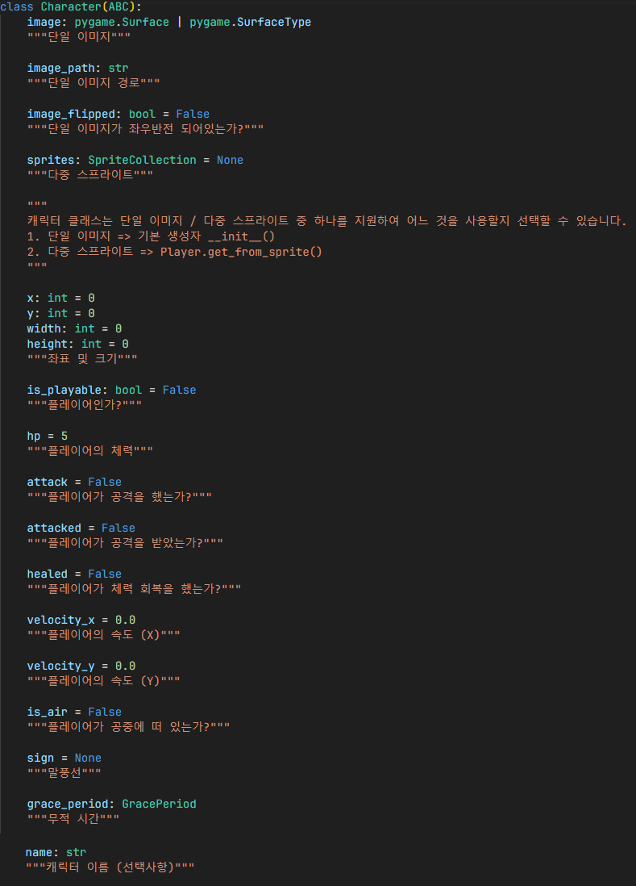
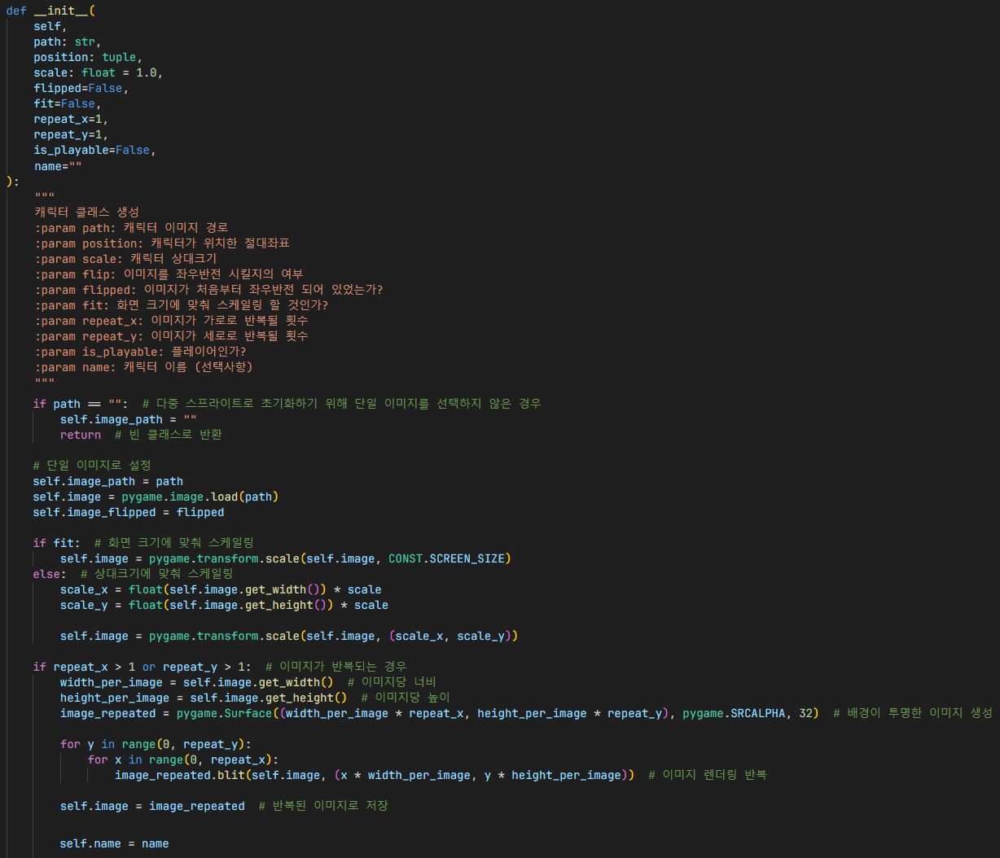
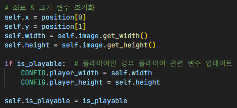
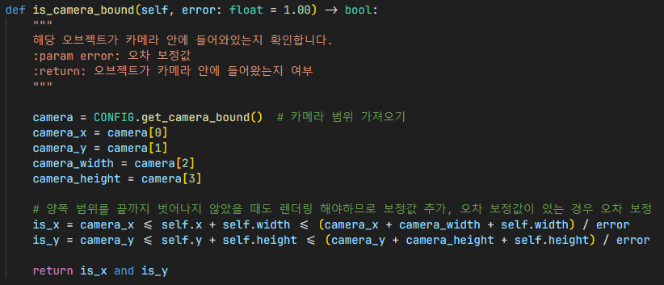
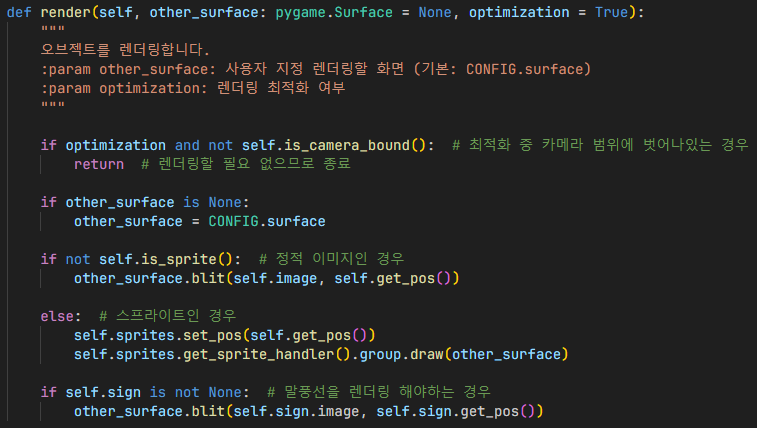
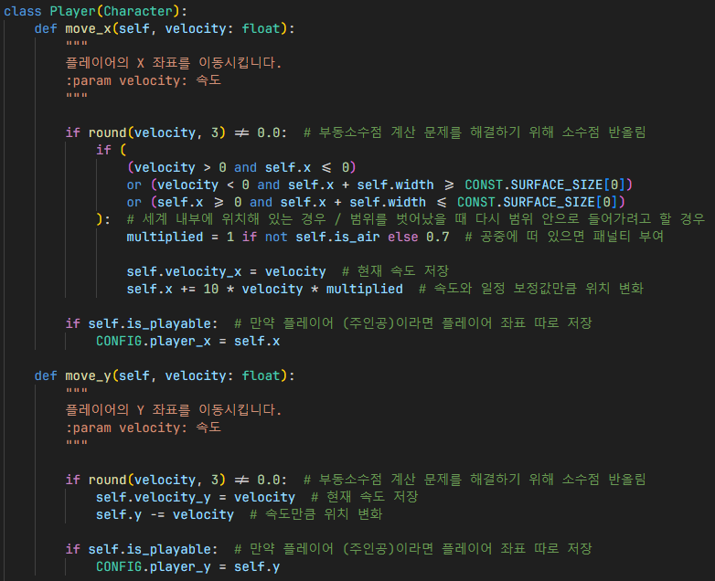
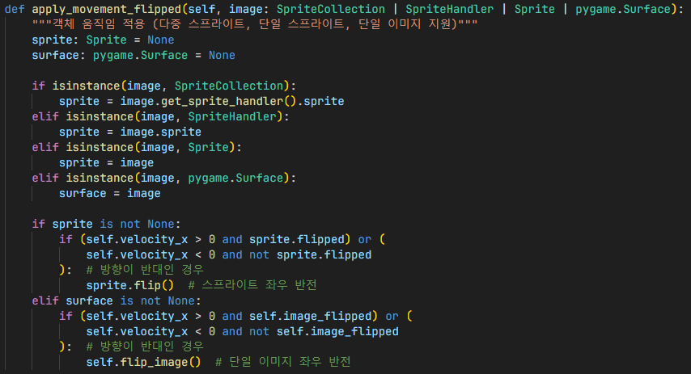
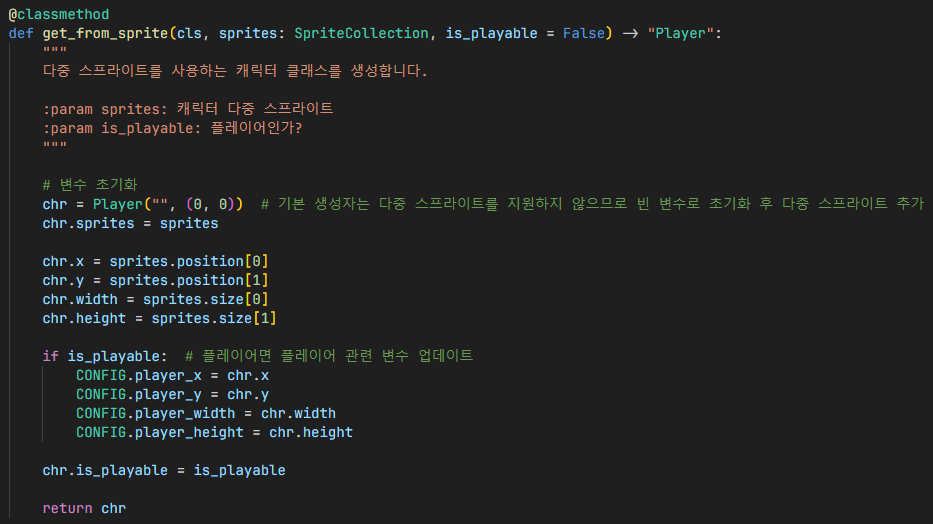

# 캐릭터
## 상속

`Character`: 플레이어, 적 및 텍스쳐 등 오브젝트의 기본 요소를 포함한 클래스

단일 이미지 / 다중 스프라이트 둘 다 지원하여,
그 중에 하나를 선택할 수 있음.

## 초기화

1. 다중 스프라이트로 초기화하는 경우 빈 클래스로 반환 => `Player.get_from_sprite()`에서 이어짐
2. 단일 이미지 생성 및 관련 변수 설정
3. `fit` 변수가 `True`로 설정되어있는 경우, 화면 크기에 맞춰 스케일링
4. 그렇지 않은 경우, 상대크기 (`scale`)에 맞춰 스케일링
5. 이미지를 반복하여 나타나게 설정했을 경우, 배경이 투명한 이미지 생성 후 그 이미지에 렌더링
6. 현재 이미지를 반복된 이미지로 덮어씌움
7. 좌표 및 크기 변수 초기화 후 `is_playable` 변수를 통하여 플레이어인 경우 관련 변수 업데이트

## 카메라 (화면) 안 범위 확인

1. 카메라 범위를 가져온 후 관련 변수 설정
2. 범위 확인 후 보정값 추가, 오차를 보정해야하는 경우 오차 보정값 추가

## 단일 이미지 / 다중 스프라이트 구분

`__init__()` (생성자 함수)에서 다중 스프라이트로 선택했으면 `image_path` 변수가 기본값으로 설정되었으므로,

`image_path`가 비어있으면 다중 스프라이트인 것을 알 수 있음.

## 렌더링

1. 최적화가 설정되어있고 카메라 범위에 벗어나있으면 렌더링할 필요 없으므로 종료 (`is_camera_bound()` 함수 이용)
2. 사용자 지정 렌더링할 화면이 없는 경우 렌더링할 화면을 기본값인 `CONFIG.surface` 화면으로 지정
3. 정적 (단일) 이미지인 경우 단일 이미지 형식에 맞춰 렌더링
4. 스프라이트인 경우 스프라이트 형식에 맞춰 렌더링
5. 말풍선도 렌더링해야하는 경우 말풍선 변수를 불러온 후 말풍선 렌더링

## 플레이어
### 움직임

X 좌표, Y 좌표 각각 속도 매개변수를 이용하여 이동시킴

1. 속도가 0이 아닌 경우 (계산시, 부동소수점 계산 문제를 해결하기 위해 소수점 반올림) 속도 저장 후 일정 위치 변화
2. 플레이어라면 플레이어 좌표 따로 저장 (업데이트)

`move_x()`에서 따로 조건문이 있는 것은 세계 좌표 범위 밖을 벗어나지 않기 위함.

### 움직이는 방향으로 이미지 좌우반전

1. 단일 이미지 / 단일 스프라이트 / 다중 스프라이트인지 확인 후 각자 맞는 형식 지정
2. 속도 방향과 현재 이미지 방향이 같지 않은 경우, 좌우 반전시킴

### 다중 스프라이트를 사용하는 Player 클래스 생성

1. 기본 생성자 (`__init__()`)에서는 단일 이미지만 지원하므로 빈 클래스로 초기화 후 다중 스프라이트 추가
2. 관련 변수 초기화
3. 플레이어면 플레이어 관련 변수 업데이트

## 적

1. 적의 체력이 0 이하인 경우 사망한 것이므로 종료
2. `is_camera_bound()` 함수를 이용하여 플레이어 화면 범위 안에 있는 경우 (이 때, 플레이어 배려를 위하여 약간의 보정값 추가) 속도 추가
3. 만약 따라가야할 위치가 플레이어에게 따라갈 수 있는 최소 위치보다 적은 경우, 위치를 갱신해도 플레이어에게 완벽히 따라가지 못하므로 움직이지 않게 최적화
4. `is_bound()` 함수를 이용하여 충돌 감지 후 주변에 장애물이 있다면 적이 점프함

## 인게임
- 추가 필요

## 참조
- [`characters/__init__.py`](../characters/__init__.py)
- [`characters/player.py`](../characters/player.py)
- [`characters/enemy.py`](../characters/enemy.py)
- [`ingame.py`](../screens/ingame.py)