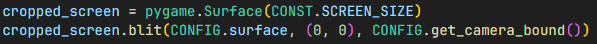
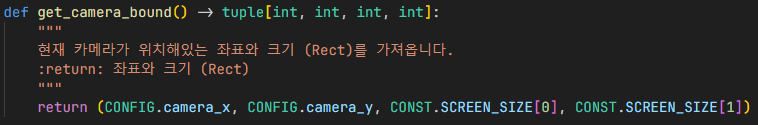

# 동적 카메라
## 1

화면 (카메라) 크기를 정해준 뒤, 주인공이 돌아다닐 세계 크기도 정함

## 2

카메라가 어디까지 움직였는지 저장할 좌표 변수 선언

## 3

1. 매 프레임 업데이트마다 플레이어가 어느만큼 움직였는지 X좌표를 계산
2. 카메라 좌표가 플레이어 중심으로 움직이게 설정
3. 세계 크기에서 오프셋을 카메라 좌표만큼 이동
4. 화면 (카메라) 크기만큼 잘라서 세계 좌표를 카메라 좌표로 변환

## 결과

세계 좌표는 움직이지 않고 고정이지만
카메라 좌표만 움직임.

모든 UI의 좌표를 변경하지 않아도 돼서
관리 및 유지 보수가 매우 편함.

## 참조
- [`config.py`](../components/config.py)