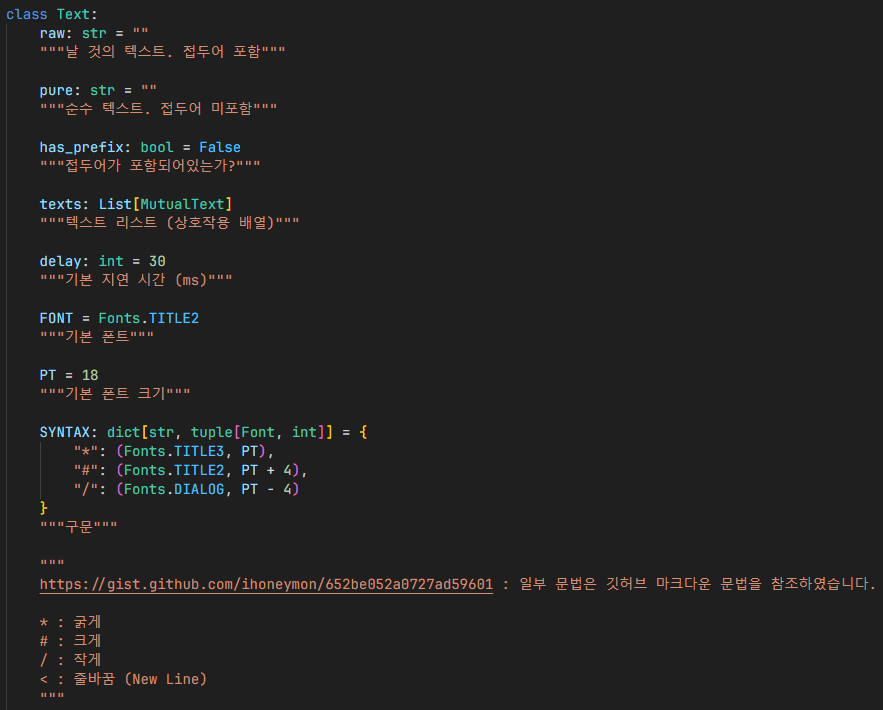
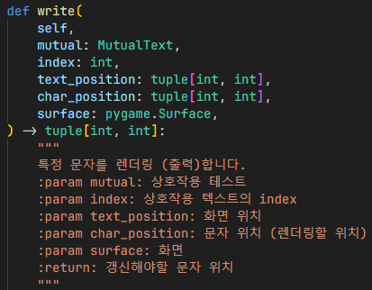
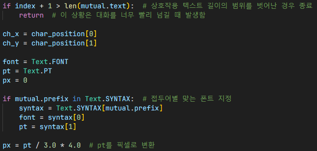
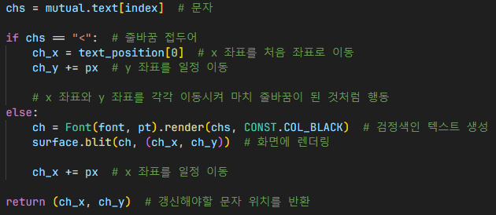
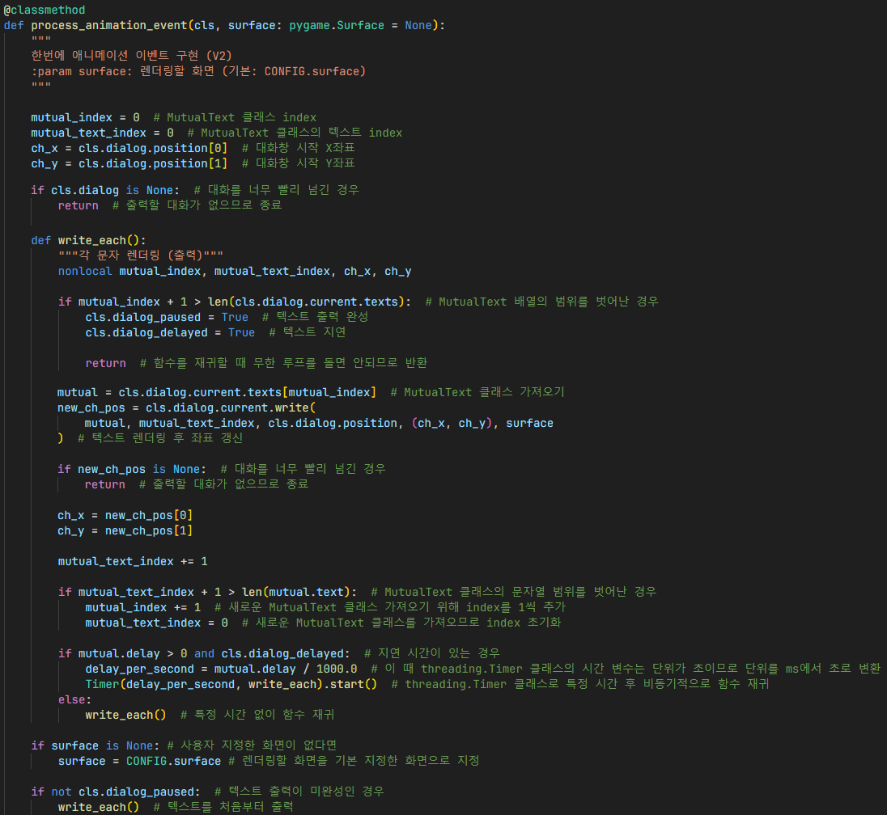

# 동적 텍스트 애니메이션
## Mutual Text

**Mutual Text**는 상호작용할 텍스트를 구분하기 위해 만들어진 클래스로,
접두어를 기준으로 나눔

즉, 텍스트에 접두어가 다양할수록 Mutual Text 배열은 많아짐.

## Text

**Text**는 Mutual Text의 배열로, 렌더링할 텍스트 (문자열) 한 단위를 말함.

아래 주석은 각 접두어가 무슨 역할을 하는지 적어놓음.

### 초기화

- `raw`: 접두어가 포함된 텍스트
- `pure`: 접두어가 포함되지 않은 순수 텍스트
- `delay`: 각 문자마다 지연할 시간

텍스트 안에 접두어가 있는 경우 `has_prefix`를 `True`로 설정 후,
접두어만 삭제한 순수 텍스트 저장

- `is_started`: 접두어가 있는지 확인
- `mutual_text_`: 각 접두어별 텍스트
- `prefix`: 접두어

1. 각 문자에 접두어가 있는 경우
2. 만약 접두어가 시작하지 않았으면 접두어 시작 변수인 `is_started`를 `True`로 설정
3. 만약 접두어가 시작했으면 접두어 시작 변수인 `is_started`를 `False`로 설정
4. Mutual Text의 텍스트가 비어있지 않은 경우 `MutualText` 클래스 생성
5. 새로운 텍스트를 받아야 하므로 Mutual Text의 텍스트 초기화
6. 텍스트 배열에 생성한 `MutualText` 클래스 추가
7. 접두어가 시작된 경우 저장, 그렇지 않으면 초기화
8. 접두어가 아닌 순수 문자인 경우 Mutual Text의 텍스트에 추가
9. 접두어가 없는 일반 텍스트로 끝난 경우 `MutualText` 클래스 생성 후 텍스트 배열에 추가

즉, 상호작용할 텍스트인 `MutualText`의 배열임.

### 문자 렌더링

1. 접두어별 맞는 폰트 지정
2. pt를 픽셀로 변환

1. 줄바꿈 접두어면 좌표를 지정, Carrige Return과 Line Feed 기능과 비슷함
2. 검정색인 문자 생성 후 화면에 렌더링
3. X 좌표를 변환한 픽셀 수만큼 이동
4. 새롭게 갱신된 문자 좌표 (위치) 반환

## TextCollection

`TextCollection`: `Text` 클래스 배열, 여러 말을 해야할 때 쓰이는 클래스

1. `Text` 속 `MutualText` 열거
2. 접두어를 확인하여 각 접두어별 맞는 폰트 크기 지정
3. 폰트 크기 (`pt`)를 픽셀로 변환
4. 문자의 크기를 텍스트 너비에 더한 후 말풍선 너비와 비교하여 범위를 벗어난 경우, 텍스트에 줄바꿈 접두어와 문자 추가
5. 범위를 벗어나지 않은 경우 텍스트에 문자만 추가
6. 기존 텍스트를 줄바꿈이 들어간 텍스트로 변경
7. 반복문을 돌면서 텍스트 너비 초기화 후 `TextCollection` 클래스에 `Text` 클래스 추가
8. 현재 출력할 `Text` 클래스와 다음 출력할 `Text` 클래스 지정

### 대화 (텍스트) 이동

1. 모든 대화 (텍스트)를 다 본 경우 `index` 변수 초기화 후 텍스트 새롭게 지정 (리셋)하고 `False` 반환
2. 아닌 경우 `index`를 더한 후 텍스트 지정하고 `True` 반환

## TextEvent

대화 이벤트 처리

### 다음 대화창 이벤트

각 변수에 따라 대화창 출력을 지연시키지 않고 완성시켜야 할지,
다음 대화창으로 넘겨야할지 이벤트를 처리함
                                      
### 대화 애니메이션 이벤트

- `mutual_index`: 현재 `Text` 클래스 속 `MutualText` 배열 index 저장
- `mutual_text_index`: 현재 `MutualText` 클래스의 텍스트 (문자열) index 저장
- `ch_x`, `ch_y`: 대화창이 시작될 좌표

#### write_each()
1. `MutualText` 배열의 범위를 벗어난 경우 텍스트 관련 변수 재설정
2. `mutual_index` 변수로 현재 `MutualText` 클래스 가져오기
3. `Text.write()` 함수로 문자 렌더링 후 좌표 갱신
4. `mutual_text_index` 변수를 갱신하여 마치 for문과 같은 행동을 함
5. `MutualText` 클래스의 문자열 범위를 벗어난 경우 새로운 `MutualText` 클래스를 가져오기 위해 index 관련 변수 재설정
6. 문자를 렌더링하고 기다려야 할 지연 시간이 있는 경우 `threading.Timer()` 클래스를 이용하여 비동기적으로 함수 재귀
7. 지연 시간이 없을 경우 바로 함수 재귀, 더 이상 갱신할 `MutualText`가 없는 경우 종료

#### process_animation_event()
1. 사용자 지정한 화면이 없을 경우 렌더링할 화면을 기본으로 지정된 화면으로 지정
2. 텍스트 출력이 미완성인 경우 `write_each()` 함수 실행하여 텍스트를 처음부터 출력

## 참조
- [`text/mutual_text.py`](../components/text/mutual_text.py)
- [`text/__init__.py`](../components/text/__init__.py)
- [`text/text_collection.py`](../components/text/text_collection.py)
- [`events/text.py`](../components/text.py)
- [`ingame.py`](../screens/ingame.py)