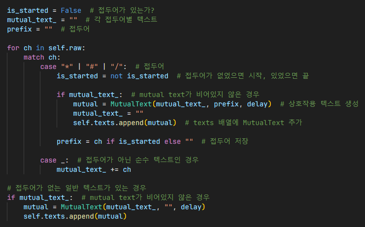

# 동적 텍스트 애니메이션
## Mutual Text

## Text

설명

### 초기화

설명

설명

### 문자 렌더링

설명

설명

설명

## TextCollection

설명

설명
- text/text_collection.py/jump_to_next

## 참조
- [ingame.py](../screens/ingame.py)
- [events/text.py](../components/text.py)
- [text/__init__.py](../components/text/__init__.py)
- [text/mutual_text.py](../components/text/mutual_text.py)
- [text/text_collection.py](../components/text/text_collection.py)