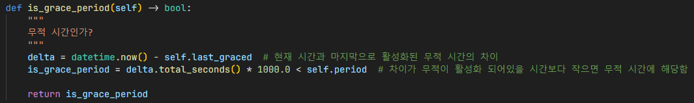
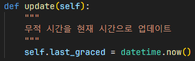

# 무적 시간

`GracePeriod`: 무적 시간을 관리하는 클래스.

무적 시간동안은 적이 플레이어를 공격할 수 없고,
플레이어도 데미지를 받지 않음.

## 무적 시간인지 확인

1. 현재 시간에서 마지막으로 활성화된 무적 시간만큼 차이를 구함
2. 그 차이가 무적시간 (무적이 활성화되어있을 시간)보다 작으면 무적 시간에 해당함

## 무적 시간 업데이트

`datetime` 클래스를 이용하여 현재 시간을 가져옴.

## 무적 시간인 것을 UI로 형상화

투명도를 임의값으로 설정하여 마치 플레이어가 무적 시간에 해당한다는 것을 알려줌.

또한, 플레이어가 데미지를 받았다는 의미도 포함됨.

## 인게임
- 추가 필요

## 참조
- [`grace_period.py`](../components/events/grace_period.py)
- [`ingame.py`](../screens/ingame.py)