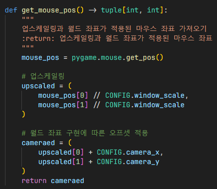

# 마우스 좌표

1. `pygame.mouse.get_pos()` 함수로 창 기준 마우스 좌표를 가져옴
2. 사용자 지정 해상도에서 고정된 640x360 해상도 기준 마우스 좌표로 변환
3. 마우스의 좌표는 카메라가 움직일 때마다 오프셋이 추가되야하므로 카메라가 움직인만큼 오프셋 추가

## 참조
- [`config.py`](../components/config.py)