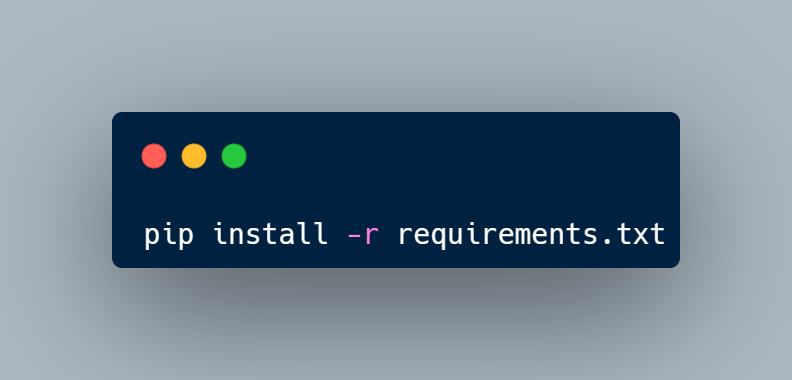
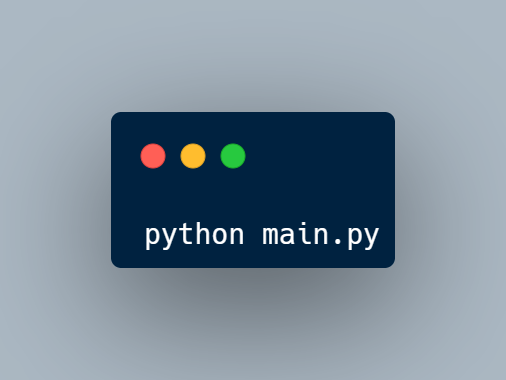

## 1 페이지

### 자기소개

안녕하세요! 저희 팀은 세이픽셀 팀입니다.\
게임 이름은 The Chromatic 입니다.

## 2 페이지

### 필요한 패키지 설치 및 게임 실행

\
`pip install -r requirements.txt` 명령어를 쉘에 입력하면 The Chromatic의 필요한 패키지를 설치됩니다.\
`python main.py` 명령어를 쉘에 입력하면 게임이 실행 됩니다.

## 4 페이지

### The Chromatic 게임의 구조
\
The Chromatic 게임의 구조는 이 사진과 같습니다.\
처음에는 main.py 파일에서 인수를 받아 `debug`, `fps`, `fullscreen`, `fullhd`, `quadhd`, `help` 명령어와 맞는 지 확인합니다.\
그리고 게임이 실행됩니다.

## 5 페이지

### 코드 설명

> TODO: 아직 협의된 부분이 없으므로 비워둡니다.

## 6 페이지

### 플레이 영상

> TODO: 아직 게임이 완성되지 않아 플레이 영상이 존재하지 않습니다.

## 7 페이지

## 크레딧
\
저희는 최대한 할 수 있는 만큼 **OST**, **Coding**, **Design**, **효과음**까지 순수 창작으로 이루어져 있습니다.\
게임 라이브러리인 **pygame**과 디버그 라이브러리인 **icecream**의 도움을 받았고 마지막으로 **Python 3.11** 버전을 기반으로 작성되어 있습니다.

## 8 페이지

### 끝
\
저희의 발표를 들어주셔서 감사합니다.
