## 1 페이지

## 제목: 자기소개

안녕하세요! 저희 팀은 세이픽셀 팀입니다.\
게임 이름은 The Chromatic 입니다.

## 2 페이지

## 제목: 필요한 패키지 설치 및 게임 실행
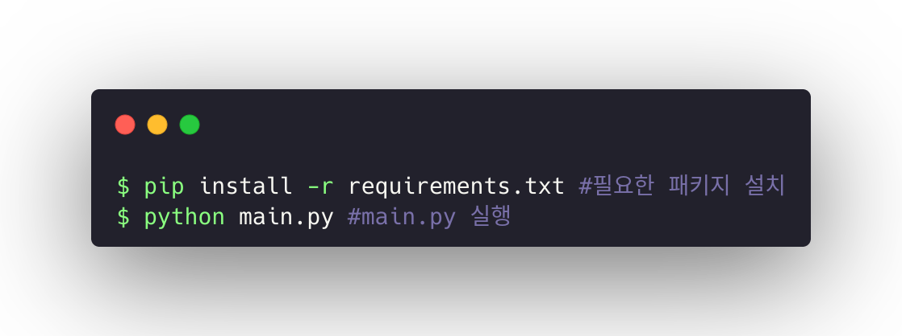\
`pip install -r requirements.txt` 명령어를 쉘에 입력하면 The Chromatic 게임의 필요한 패키지를 설치됩니다.\
`python main.py` 명령어를 쉘에 입력하면 게임이 실행 됩니다.

## 3 페이지

## 제목: The Chromatic 게임의 구조
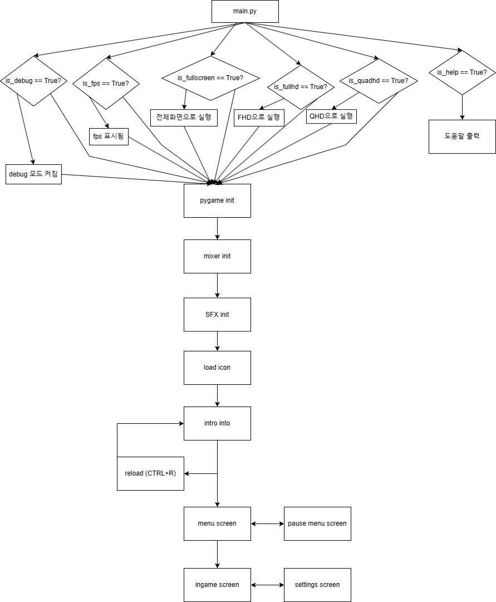\
The Chromatic 게임의 구조는 이 사진과 동일합니다.\
처음에는 `main.py` 파일에서 인수를 받아 `debug`, `fps`, `fullscreen`, `fullhd`, `quadhd`, `help` 명령어와 맞는 지 확인합니다.\
그리고 게임이 실행됩니다.

## 3.5 페이지

## 제목: 프로토타입
### 인트로
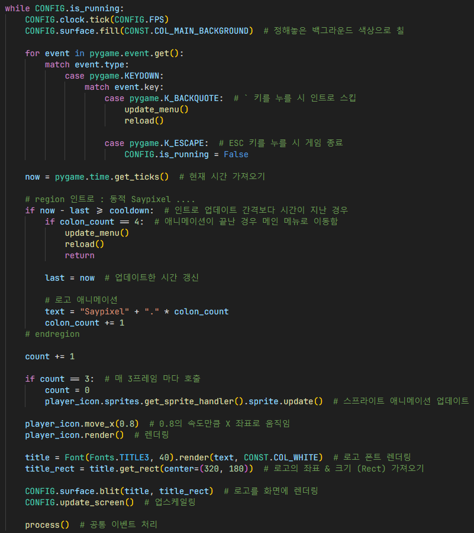

매 프레임마다 정해놓은 백그라운드 색상으로 칠하고, 인트로 로고를 업데이트 간격을 정해놓아 로고 애니메이션을 생성합니다.

로고 애니메이션이 완료된 경우 메인 메뉴 화면으로 이동됩니다.
또한 미니 플레이어의 스프라이트 애니메이션을 업데이트하여, 마치 미니 플레이어가 인트로 화면에서 뛰는 느낌을 줍니다.

로고 텍스트와 미니 플레이어를 렌더링하여 사용자에게 인트로 화면을 표시합니다.

### 결과
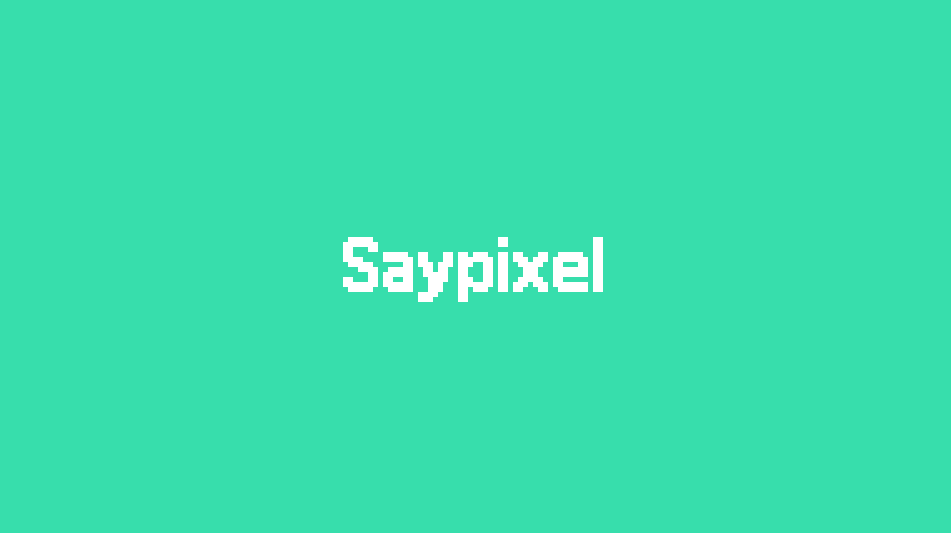

### 메인 메뉴
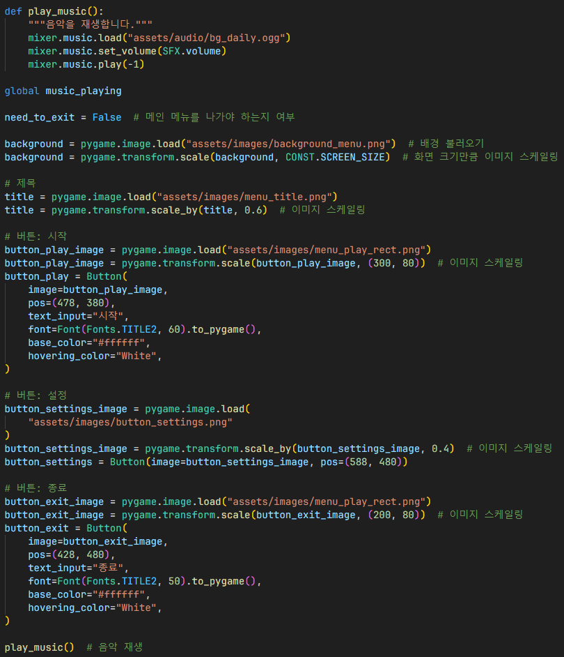
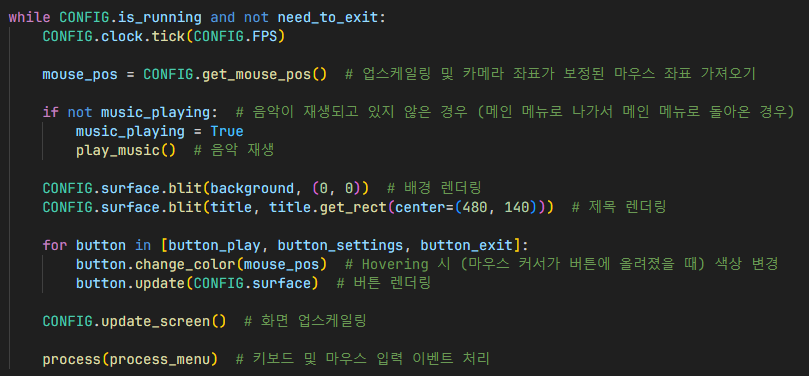

각 오브젝트의 이미지를 불러오고 스케일링하여 화면에 불러오고 렌더링할 수 있도록 합니다.

메인 메뉴의 음악을 재생함으로써, 설정에서 정해진 음량으로 음량을 정하고 음악을 무한 반복합니다.

### 설정
> TODO: 미완성

## 결과
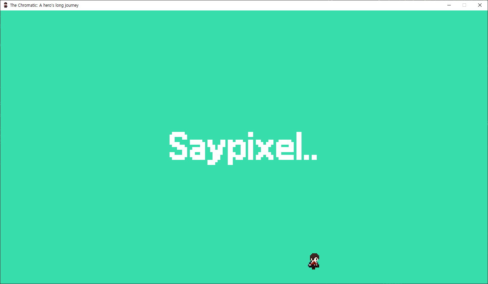

## 4 페이지

## 제목: 코드 설명

1. [`동적 카메라`](#제목-동적-카메라)
2. [`업스케일링`](#제목-업스케일링)
3. [`마우스 좌표`](#제목-마우스-좌표)
4. [`동적 텍스트 애니메이션`](#제목-동적-텍스트-애니메이션)

## 6 페이지

## 제목: 동적 카메라

## 세계 크기 선언
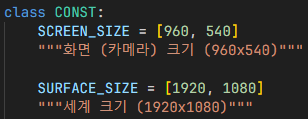

화면 및 카메라 크기를 정해준 뒤, 주인공이 돌아다니는 세계 크기도 정합니다.

## 카메라 좌표 선언
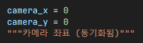

카메라가 어디까지 움직였는지 저장할 좌표 변수로 선언합니다.

## 동적 카메라 작동 원리
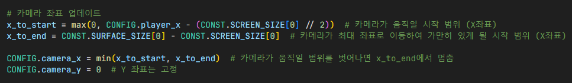
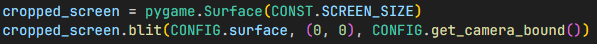
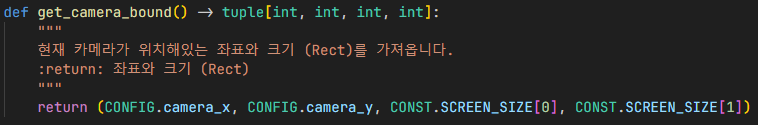

매 프레임 업데이트마다 플레이어가 어느만큼 움직였는지 X좌표를 계산하고, 카메라 좌표가 플레이어 중심으로 움직이게 설정합니다.
그리고, 세계 크기에서 오프셋을 카메라 좌표만큼 이동시키고 화면 크기만큼 잘라서 세계 좌표를 카메라 좌표로 변환합니다.

## 결과
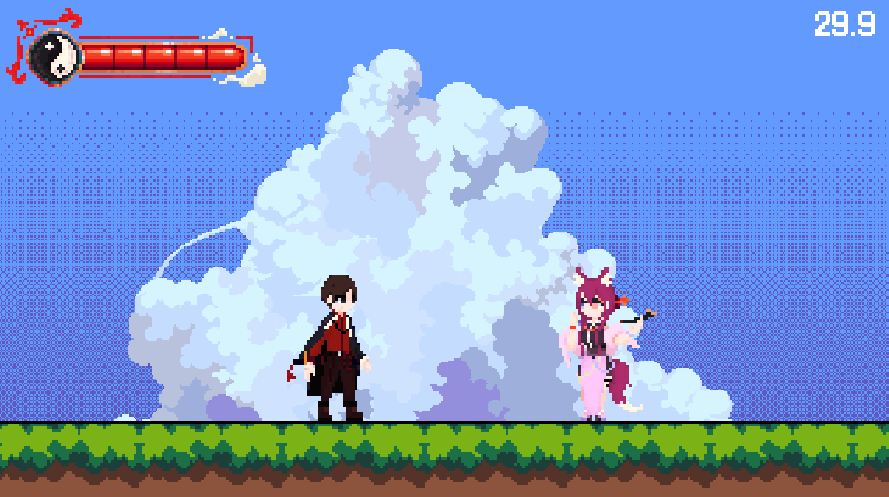

세계 좌표는 고정이지만 카메라 좌표만 움직입니다.

## 7 페이지

## 제목: 업스케일링
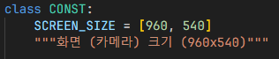
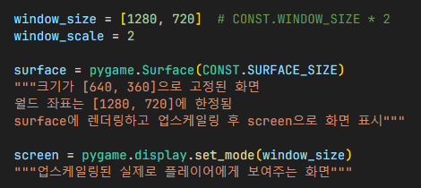
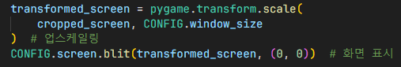

본래 렌더링되는 화면의 크기를 정하고, 업스케일링 할 크기를 정하고 몇배만큼 늘릴건지 정합니다.
`pygame.transform.scale()` 함수로 surface 변수에 렌더링 후 업스케일하고 화면 출력합니다.

## 8 페이지

## 제목: 마우스 좌표
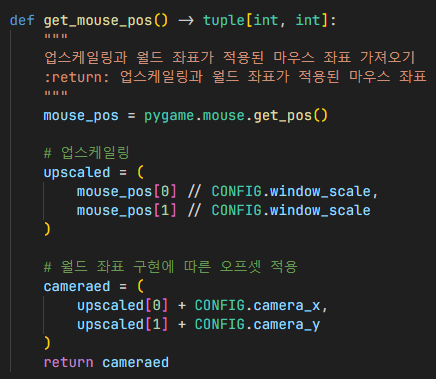

`pygame.mouse.get_pos()` 함수로 창 기준 마우스 좌표를 가져옵니다.
사용자 지정 해상도에서 고정된 640x360 해상도 기준으로 마우스 좌표로 변환하고 카메라가 움직인만큼 오프셋 추가합니다.

## 9 페이지

### 제목: 동적 텍스트 애니메이션

## Mutual Text
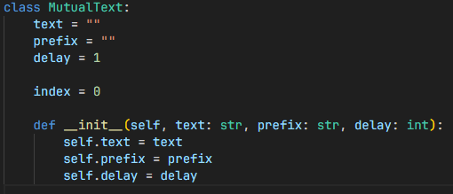

**Mutual Text** 클래스는 상호작용할 텍스트를 구분하기 위해 만들어진 클래스로,
접두어를 기준으로 나눕니다.

## Text

**Text**는 *Mutual Text*의 배열로, 렌더링할 텍스트 (문자열) 한 단위를 말합니다.

### 초기화
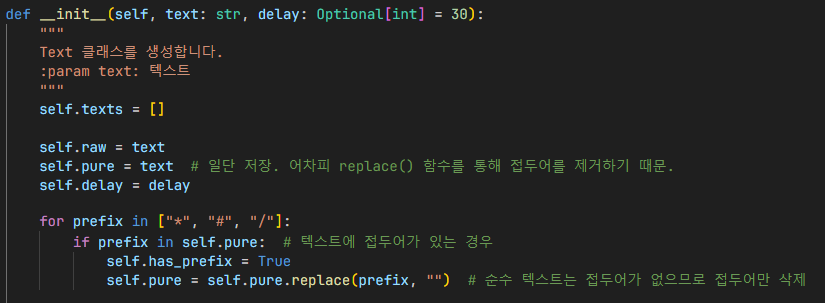

텍스트 안에 접두어가 있는 경우, 접두어만 삭제한 순수 텍스트 저장합니다.

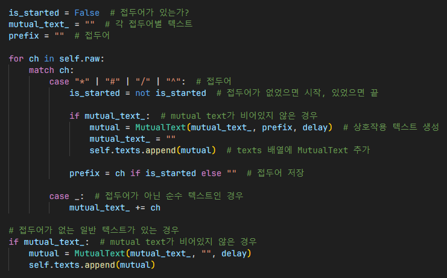

각 문자에 접두어가 있는 경우에는
만약 접두어가 시작하지 않았으면 접두어 시작 변수인 `is_started`를 `True`로 설정하고, 반대인 경우에는 접두어 시작 변수인 `is_started`를 `False`로 설정합니다.
Mutual Text의 텍스트가 비어있지 않은 경우 `MutualText` 클래스 생성하고 텍스트 초기화됩니다.
텍스트 배열에 생성한 `MutualText` 클래스를 `self.texts` 변수에 넣습니다.
접두어가 시작된 경우 저장, 그렇지 않으면 초기화를 하고 접두어가 아닌 순수 문자인 경우 `MutualText`의 텍스트에 `prefix` 변수를 추가합니다.
접두어가 없는 일반 텍스트로 끝난 경우 `MutualText` 클래스 생성 후 텍스트 배열에 추가됩니다.

### 문자 렌더링
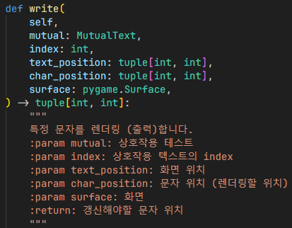
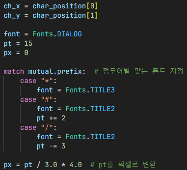

상호작용 텍스트 길이 범위를 벗어난 경우, 오류가 일어날 수 있으므로 함수 종료합니다. 이렇게 하는 이유는 대화를 너무 빨리 넘길 때 오류 발생됩니다.
접두어별 맞는 폰트 지정하고 `pt`를 픽셀로 변환합니다.

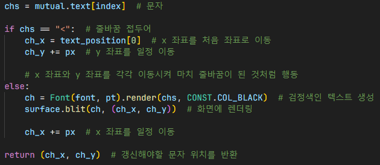

줄바꿈 접두어면 좌표를 지정, 검정색인 문자 생성 후 화면에 렌더링합니다.
X 좌표를 변환한 픽셀 수만큼 일정 이동하고, 새롭게 갱신된 문자 좌표 반환합니다.

## TextCollection
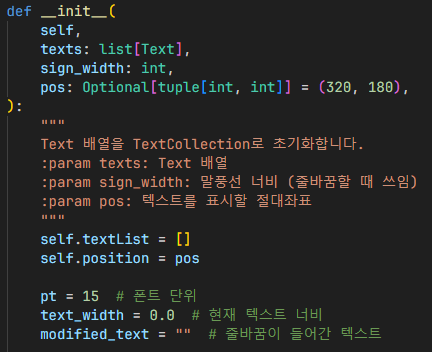

`TextCollection`: `Text` 클래스 배열, 여러 말을 해야할 때 쓰이는 클래스

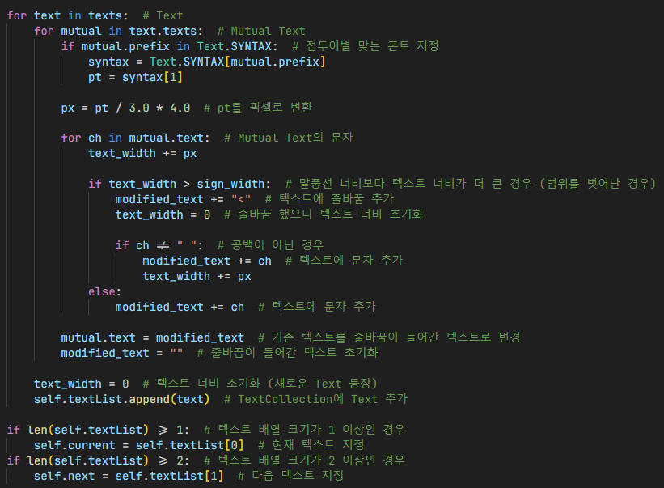

`Text` 속 `MutualText` 열거합니다.
접두어를 확인하여 각 접두어별 맞는 폰트 크기 지정하고,
폰트 크기를 픽셀로 변환합니다.
문자의 크기를 텍스트 너비에 더한 후 말풍선 너비와 비교하여 범위를 벗어난 경우, 텍스트에 줄바꿈 접두어와 문자 추가로 자동 줄바꿈 기능을 만들었습니다.
그 다음에는 범위를 벗어나지 않은 경우 텍스트에 문자만 추가하고 기존 텍스트를 줄바꿈이 들어간 텍스트로 변경합니다.
반복문을 돌면서 텍스트 너비 초기화 후 `TextCollection` 클래스에 `Text` 클래스 추가하고 현재 출력할 `Text` 클래스와 다음 출력할 `Text` 클래스 지정합니다.

### 대화 (텍스트) 이동
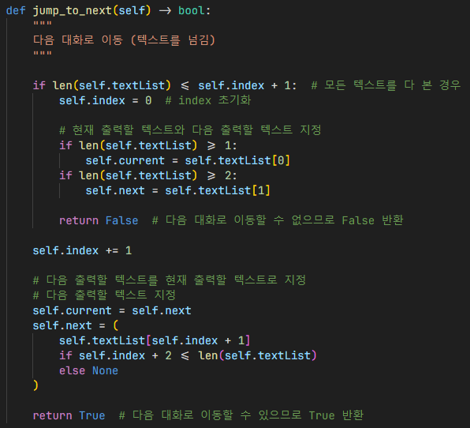

모든 텍스트를 다 본 경우 `index` 변수 초기화 후 텍스트 리셋하고 `False` 반환되고 아닌 경우에는 `index`를 더한 후 텍스트 지정하고 `True` 반환합니다.

## TextEvent
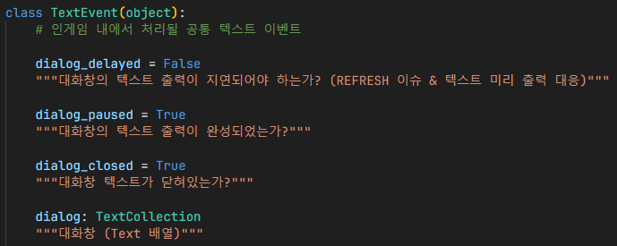

**TextEvent** 클래스는 대화 이벤트 처리입니다.

### 다음 대화창 이벤트
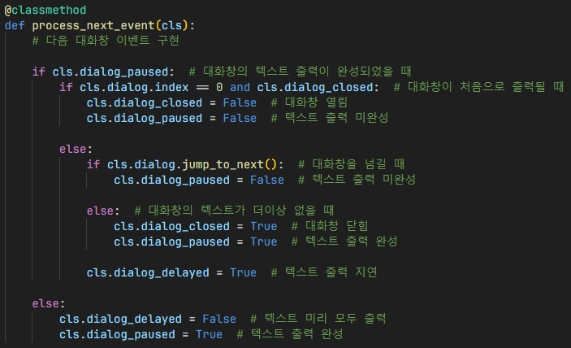

각 변수에 따라 대화창 출력을 지연시키지 않고 완성시켜야 할지,
다음 대화창으로 넘겨야할지 이벤트를 처리합니다.
                                      
### 대화 애니메이션 이벤트
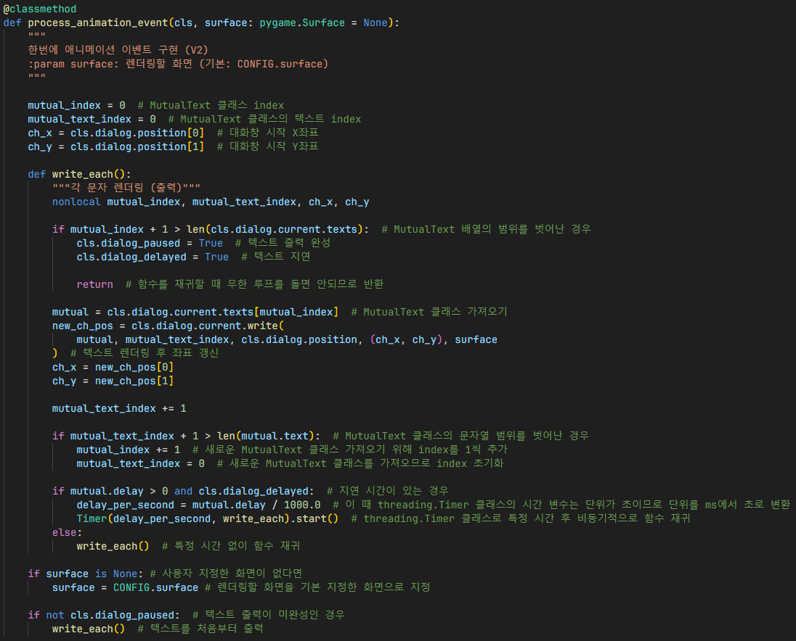

#### write_each()
1. 상호작용 텍스트 배열 범위를 벗어난 경우, 오류가 일어날 수 있으므로 함수 종료, 이는 대화를 너무 빨리 넘길 때 발생
2. `MutualText` 배열의 범위를 벗어난 경우 텍스트 관련 변수 재설정
3. `mutual_index` 변수로 현재 `MutualText` 클래스 가져오기
4. `Text.write()` 함수로 문자 렌더링 후 좌표 갱신
5. 대화를 너무 빨리 넘겨서 `write()` 함수에서 오류를 반환한 경우, 함수 종료
6. `mutual_text_index` 변수를 갱신하여 마치 for문과 같은 행동을 함
7. `MutualText` 클래스의 문자열 범위를 벗어난 경우 새로운 `MutualText` 클래스를 가져오기 위해 index 관련 변수 재설정
8. 문자를 렌더링하고 기다려야 할 지연 시간이 있는 경우 `threading.Timer()` 클래스를 이용하여 비동기적으로 함수 재귀
9. 지연 시간이 없을 경우 바로 함수 재귀, 더 이상 갱신할 `MutualText`가 없는 경우 종료

#### process_animation_event()
1. 사용자 지정한 화면이 없을 경우 렌더링할 화면을 기본으로 지정된 화면으로 지정
2. 텍스트 출력이 미완성인 경우 `write_each()` 함수 실행하여 텍스트를 처음부터 출력

## 인게임
### 대화 애니메이션 이벤트
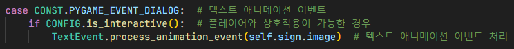

1. 플레이어와 상호작용이 가능한 경우
2. `TextEvent.process_animation_event()` 함수를 이용하여 텍스트 애니메이션 이벤트 처리

### 대화 상호작용 키를 누른 경우에 진행될 대화 이벤트
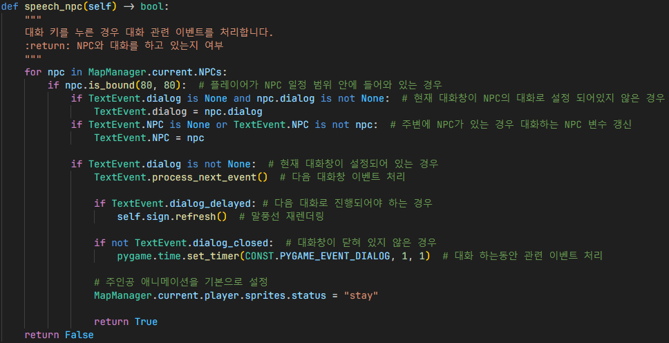

1. 현재 맵에 있는 NPC 열거
2. NPC 일정 범위에 해당하는 경우 실행 (충돌 감지 함수 이용)
3. 현재 대화창이 해당 NPC의 대화로 설정 되어있지 않은 경우 대화창 변수 갱신
4. 현재 대화창이 설정되어 있는 경우, 다음 대화창과 그 애니메이션 이벤트 처리 (`TextEvent.process_next_event()`와 `PYGAME_EVENT_DIALOG` 이용)
5. 다음 대화로 진행되어야 하는 경우 말풍선을 재렌더링하여 기존 렌더링된 텍스트를 덮어씌움

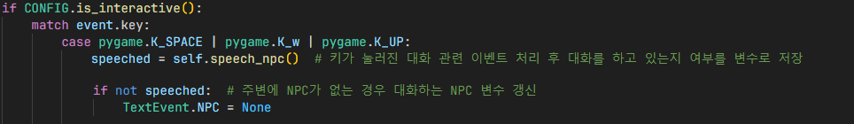

1. 대화 이벤트 처리 후 대화를 하고 있는지의 여부를 `speeched` 변수에 저장
2. 주변에 대화할 NPC가 없는 경우 대화하는 NPC 변수 초기화

## 결과
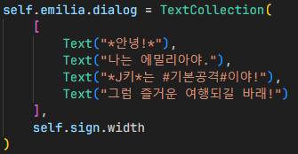

NPC에게 대화 텍스트를 위에 설명한 클래스 형식에 맞게 적용됩니다.

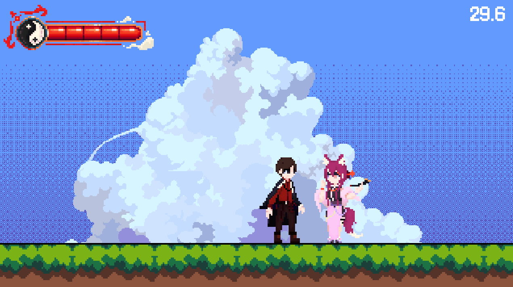

`MutualText`, `Text`, `TextCollection`, `TextEvent` 클래스의 조화로 이루어진 종합적인 결과, 코드가 많고 복잡한 데도 불구하고 30FPS 유지, 디자인과 성능을 모두 고려한 예술 작품입니다. 이것은 Saypixel 팀의 재량을 발휘한 것이죠.

## 10 페이지

## 제목: 플레이 영상

- https://youtu.be/hkwRBZQYmuw

## 11 페이지

## 제목: 크레딧
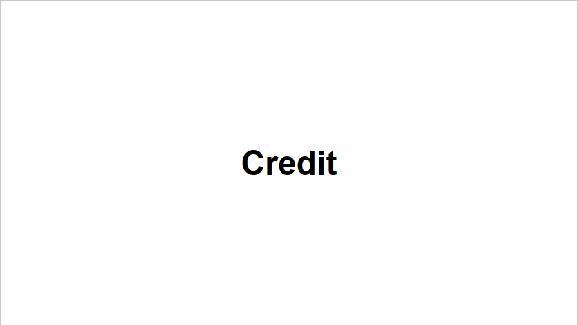\
저희는 최대한 할 수 있는 만큼 **BGM**, **Coding**, **Design**, **효과음**까지 순수 창작으로 이루어져 있습니다.\
게임 라이브러리인 **pygame**과 디버그 라이브러리인 **icecream**의 도움을 받았고 마지막으로 **Python 3.11** 버전을 기반으로 작성되어 있습니다.

## 12 페이지

### 제목: 끝
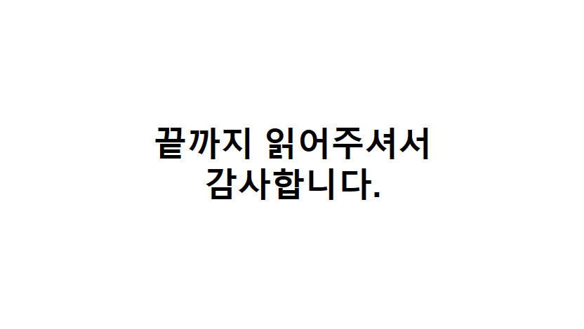\
저희의 발표를 들어주셔서 감사합니다.
