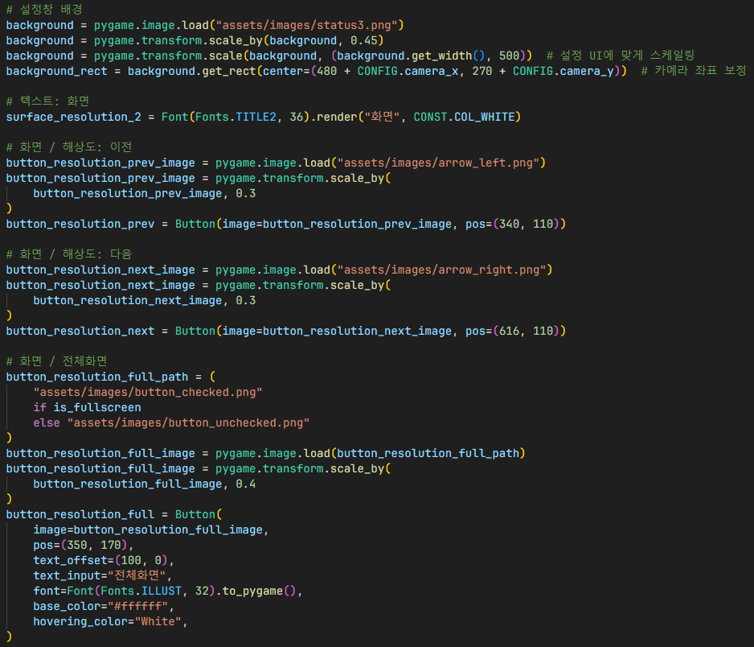
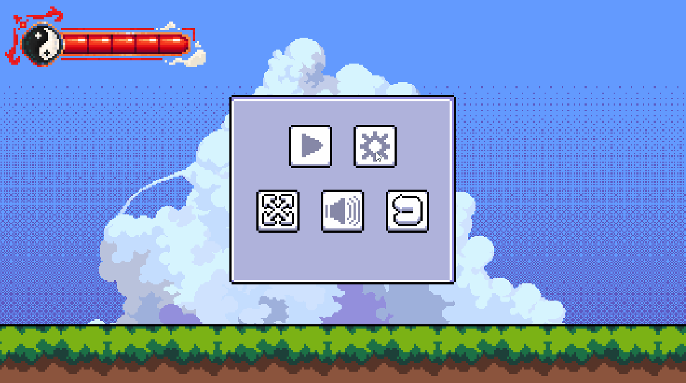
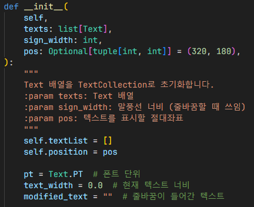
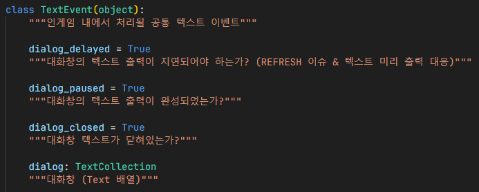

## 1 페이지

## 제목: 자기소개

안녕하세요! 저희 팀은 세이픽셀 팀입니다.\
게임 이름은 **The Chromatic** 입니다.

## 2 페이지

## 제목: 필요한 패키지 설치 및 게임 실행
\
`pip install -r requirements.txt` 명령어를 쉘에 입력하면 The Chromatic 게임의 필요한 패키지가 설치됩니다.\
`python main.py` 명령어를 쉘에 입력하면 게임이 실행 됩니다.

## 3 페이지

## 제목: The Chromatic 게임의 구조
\
The Chromatic 게임의 구조는 이 사진과 동일합니다.\
처음에는 `main.py` 파일에서 인수를 받아 `debug`, `fps`, `fullscreen`, `fullhd`, `quadhd`, `help` 명령어와 맞는 지 확인합니다.\
그리고 게임이 실행됩니다.

## 4 페이지
## 제목: 게임 흐름
훈련장에 가는 문을 열고, 훈련장에서 장애물을 피하고 적을 쓰러뜨리는 게임

## 제목: 게임 방법
- `A`, `D` / `←`, `→`: 이동
- `W` / `↑` / `Space`: 점프 / NPC와 대화
- `ESC`: 일시중지 화면 표시 (인게임 내) / 게임 종료
- `J`: 기본 공격
- `E`: 아이템 사용
- `Shift`: 아이템 변경
- `R`: 시간을 5초 전으로 되돌리기

## 5 페이지

## 제목: 프로토타입
### 인트로

매 프레임마다 정해놓은 백그라운드 색상으로 칠하고, 인트로 로고를 업데이트 간격을 정해놓아 로고 애니메이션을 생성합니다.

로고 애니메이션이 완료된 경우 메인 메뉴 화면으로 이동됩니다.
또한 미니 플레이어의 스프라이트 애니메이션을 업데이트하여, 마치 미니 플레이어가 인트로 화면에서 뛰는 느낌을 줍니다.

로고 텍스트와 미니 플레이어를 렌더링하여 사용자에게 인트로 화면을 표시합니다.

### 결과

### 메인 메뉴

각 오브젝트의 이미지를 불러오고 스케일링하여 화면에 불러오고 렌더링할 수 있도록 합니다.

메인 메뉴의 음악을 재생함으로써, 설정에서 정해진 음량으로 음량을 정하고 음악을 무한 반복합니다.

### 결과

### 설정
#### 화면 해상도 업데이트

전체화면으로 설정해야하는 경우, `pygame.display.set_mode()` 함수를 통해 전체화면으로 설정할지, 창모드로 설정할지 정합니다.

#### 설정창을 화면에 표시

각 오브젝트의 이미지를 불러오고 스케일링하여 화면에 불러오고 렌더링할 수 있도록 합니다.

렌더링할 때 업스케일링 기능과 동적 카메라 좌표 기능에 의해 좌표가 의도하지 않게 어긋날 수 있으므로,

2가지 기능을 고려하여 카메라 좌표를 보정합니다.

각 오브젝트 및 버튼을 각각 렌더링하여 화면에 표시합니다.

참고로 렌더링할 때 `pygame.Surface.blit()` 함수를 사용하였습니다.

### 결과

### 인게임

매 프레임마다 돌며, 동적 카메라 좌표를 동기화하기 위해 일부 UI 좌표를 카메라 좌표로 따라갑니다.

시간 관리 이벤트를 처리하며, 현재 플레이어가 위치해 있는 맵의 UI를 렌더링합니다.

플레이어의 이미지를 방향에 맞게 동기화하고, 플레이어가 공격할 때 공격 FX를 렌더링하여 화면에 표시합니다.

이 때 FX의 이미지도 방향에 따라 동기화됩니다.

플레이어가 공격을 받았는지 회복을 했는지에 따라 체력이 달라져야하므로 플레이어의 체력을 이벤트에 따라 갱신합니다.

만약 주변에 NPC가 있는 경우 그 주변 NPC와 대화합니다. 대화 이벤트는 `TextEvent` 클래스에 의해 처리됩니다.

플레이어가 걷는지 가만히 있는지 확인 후 그에 맞는 스프라이트 애니메이션을 지정합니다.

체력 바 UI도 렌더링하며 체력 바 UI도 같이 체력 값과 동기화됩니다.

인벤토리에 들어있는 아이템과 인벤토리 텍스쳐를 각각 렌더링합니다.

## 6 페이지

## 제목: 코드 설명

1. [`동적 카메라`](#제목-동적-카메라)
2. [`업스케일링`](#제목-업스케일링)
3. [`마우스 좌표`](#제목-마우스-좌표)
4. [`시간 관리`](#제목-시간-관리)
5. [`동적 텍스트 애니메이션`](#제목-동적-텍스트-애니메이션)

## 7 페이지

## 제목: 동적 카메라

## 세계 크기 선언

화면 및 카메라 크기를 정해준 뒤, 주인공이 돌아다니는 세계 크기도 정합니다.

## 카메라 좌표 선언

카메라가 어디까지 움직였는지 저장할 좌표 변수로 선언합니다.

## 동적 카메라 작동 원리

매 프레임 업데이트마다 플레이어가 얼마만큼 움직였는지 X좌표를 계산하고, 카메라 좌표가 플레이어 중심으로 움직이게 설정합니다.
그리고, 세계 크기에서 오프셋을 카메라 좌표만큼 이동시키고 화면 크기만큼 잘라서 세계 좌표를 카메라 좌표로 변환합니다.

## 결과

세계 좌표는 고정이지만 카메라 좌표만 움직입니다.

## 8 페이지

## 제목: 업스케일링

본래 렌더링 되는 화면의 크기를 정하고, 업스케일링 할 크기를 정하고 몇 배만큼 늘릴 건지 정합니다.
`pygame.transform.scale()` 함수로 surface 변수에 렌더링 후 업스케일하고 화면을 출력합니다.

## 9 페이지

## 제목: 마우스 좌표

`pygame.mouse.get_pos()` 함수로 창 기준 마우스 좌표를 가져옵니다.
사용자 지정 해상도에서 고정된 960x540 해상도 기준으로 마우스 좌표로 변환하고 카메라가 움직인만큼 오프셋을 추가합니다.

## 10 페이지

## 제목: 시간 관리

시간 관리 키를 누른 경우에는 버그 방지를 하기 위해서 대화창이 닫혀 있는지 확인합니다.

시간 관리 변수 갱신 후 메인 음악을 일시정지하고 시간 관리 효과음을 재생합니다.

시간을 되감는 변수가 활성화되면, 캐릭터의 현재 속도값과 좌표를 전 프레임의 값으로 갱신합니다.

그렇지 않은 경우, 매 프레임마다 캐릭터들의 위치를 저장합니다.

시간을 다 되감은 경우 메인 음악을 다시 재생시켜 기본 상태로 돌아갑니다.

## 결과

`R`키를 눌러 시간을 되돌릴 수 있습니다.

## 11 페이지

### 제목: 동적 텍스트 애니메이션

## Mutual Text

**Mutual Text** 클래스는 상호작용할 텍스트를 구분하기 위해 만들어진 클래스로,
접두어를 기준으로 나눕니다.

## Text

**Text**는 *Mutual Text*의 배열로, 렌더링할 텍스트 (문자열) 한 단위를 말합니다.

### 초기화

텍스트 안에 접두어가 있는 경우, 접두어만 삭제한 순수 텍스트를 저장합니다.

### 문자 렌더링

접두어별 맞는 폰트를 지정하고 `pt`를 픽셀로 변환합니다.

줄바꿈 접두어면 좌표를 지정하고, 색상이 검정인 각 문자를 생성 후 화면에 렌더링합니다.

X 좌표를 변환한 픽셀 수만큼 일정 이동하고, 새롭게 갱신된 문자 좌표를 반환합니다.

## TextCollection

`TextCollection`: `Text` 클래스 배열, 여러 말을 해야할 때 쓰이는 클래스

`Text` 속 `MutualText`를 열거합니다.
접두어를 확인하여 각 접두어별 맞는 폰트 크기를 지정하고,
폰트 크기를 픽셀로 변환합니다.
문자의 크기를 텍스트 너비에 더한 후 말풍선 너비와 비교하여 범위를 벗어난 경우,
텍스트에 줄바꿈 접두어와 문자를 추가하여 자동 줄바꿈을 기능합니다.

그 다음에는 범위를 벗어나지 않은 경우 텍스트에 문자만 추가하고 기존 텍스트를 줄바꿈이 들어간 텍스트로 변경합니다.
반복문을 돌면서 텍스트 너비 초기화 후 `TextCollection` 클래스에 `Text` 클래스 추가하고 현재 출력할 `Text` 클래스와 다음 출력할 `Text` 클래스를 지정합니다.

### 대화 (텍스트) 이동

모든 텍스트를 다 본 경우 텍스트 순서 관련 변수인 `index` 변수를 초기화합니다.
모든 텍스트를 다 보지 않은 경우 `index` 변수 값을 추가하여 텍스트 순서를 갱신합니다.

## TextEvent

**TextEvent**는 대화 이벤트를 처리하는 클래스입니다.

### 다음 대화창 이벤트

각 변수에 따라 대화창 출력을 지연시키지 않고 완성시켜야 할지,
다음 대화창으로 넘겨야 할지 이벤트를 처리합니다.
                                      
### 대화 애니메이션 이벤트

#### write_each()
각 문자를 출력하는 함수입니다.

이 때, 출력하기 위해 기다리는 지연을 구현하기 위해 `threading.Timer()` 클래스를 이용하여 비동기적으로 구현하였습니다.

#### process_animation_event()
사용자가 지정한 화면이 없으면 화면을 기본 지정된 화면으로 나오고,
텍스트 출력이 미완성인 경우에는 `write_each()` 함수 실행하여 텍스트를 처음부터 출력합니다.

## 12 페이지
### 부제목: 인게임
### 대화 애니메이션 이벤트

플레이어와 상호작용이 가능한 경우에만 `TextEvent.process_animation_event()` 함수를 이용하여 텍스트 애니메이션 이벤트를 처리합니다.

### 대화 상호작용 키를 누른 경우에 진행될 대화 이벤트

현재 맵에 있는 NPC가 일정 범위에 해당하는 경우, 대화 애니메이션 이벤트를 처리합니다.

대화 이벤트 처리 후 대화를 하고 있는지의 여부를 `speeched` 변수에 저장합니다.

주변에 대화할 NPC가 없는 경우 대화하는 NPC 변수를 초기화합니다.

## 결과

NPC에게 대화 텍스트를 위에 설명한 클래스 형식에 맞게 적용됩니다.

`MutualText`, `Text`, `TextCollection`, `TextEvent` 클래스의 조화로 이루어진 종합적인 결과, 

코드가 많고 복잡한 데도 불구하고 30FPS 유지되며 디자인과 성능을 모두 고려한 예술 작품입니다.

이것은 __**Saypixel**__ 팀의 재량을 발휘한 것이죠.

## 13 페이지

## 제목: 플레이 영상

- https://youtu.be/hkwRBZQYmuw

## 14 페이지

## 제목: 크레딧
\
저희는 최대한 할 수 있는 만큼 **BGM**, **Coding**, **Design**, **효과음**까지 순수 창작으로 이루어져 있습니다.\
게임 라이브러리인 **pygame**과 디버그 라이브러리인 **icecream**의 도움을 받았고 마지막으로 **Python 3.11** 버전을 기반으로 작성되어 있습니다.

## 15 페이지

### 제목: 끝
\
저희의 발표를 들어주셔서 감사합니다.
