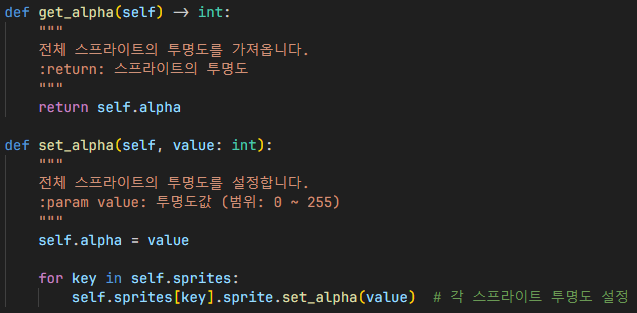

# 스프라이트
## Sprite

`Sprite`: 단일 스프라이트의 애니메이션 구현

## 스프라이트를 각 프레임으로 분할

세로줄과 가로줄만큼 반복하여 각각 프레임으로 분할

1. 상속된 클래스 초기화
2. 단일 스프라이트의 이미지를 불러온 후 `strip_from_sheet()` 함수를 이용하여 스프라이트를 분할
3. 스케일링 후 변수 초기화
4. 스프라이트의 첫번째 프레임 (이미지) 지정

- `added_index`: 일부 프레임을 스킵하고 특정 프레임으로 이동할 수 있음.

1. 현재 `index`가 프레임 배열 길이 범위를 벗어난 경우 초기화
2. 프레임 업데이트

`update()` 함수 실행 시 다음 프레임으로 이동함.

특정 프레임마다 `update()` 함수를 실행하여 애니메이션을 구현할 수 있음.

## SpriteHandler

`SpriteHandler`: `Sprite` (단일 스프라이트)를 쉽게 쓰고 관리할 수 있음.

단일/다중 스프라이트를 렌더링할 때 `group` 변수를 통해 렌더링하게 되는데

`group` 변수로만 스프라이트를 관리하기에는 충분하지 않아,
따로 관리할 수 있는 `SpriteHandler` 클래스를 만들게 되었음.

## SpriteCollection

`SpriteCollection`: 다중 스프라이트를 지원하고 관리 가능한 클래스

### 렌더링할 스프라이트 가져오기

`status` 변수로 현재 렌더링할 스프라이트를 지정하여,
현재 렌더링할 스프라이트를 가져옴.

### 좌표 동기화

모든 스프라이트의 좌표를 지정

### 초기화

1. 변수 초기화
2. 모든 스프라이트가 위치할 좌표를 지정
3. 스케일링
4. 크기를 명시하지 않은 경우 스프라이트 크기를 기본 스프라이트의 크기로 설정

### 투명도 설정

모든 스프라이트의 투명도 설정

## 인게임
- 추가 필요

## 참조
- [`sprites/sprite.py`](../components/sprites/sprite.py)
- [`sprites/sprite_handler.py`](../components/sprites/sprite_handler.py)
- [`sprites/sprite_collection.py`](../components/sprites/sprite_collection.py)
- [`ingame.py`](../screens/ingame.py)