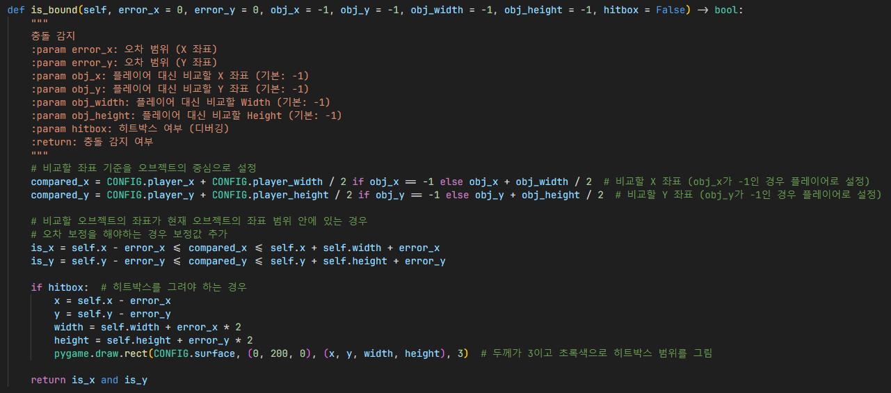
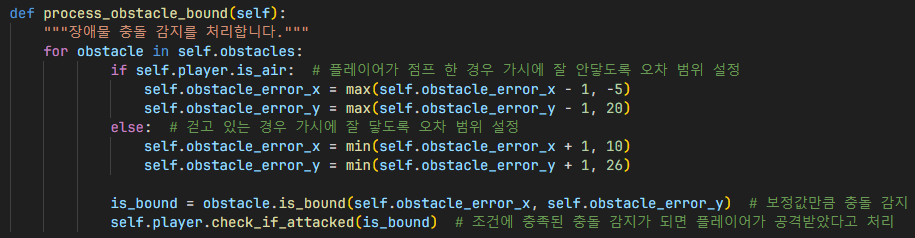

# 충돌 감지

1. `obj_x` / `obj_y`가 `-1`인 경우, 비교할 좌표를 플레이어 좌표로 설정
2. 그렇지 않은 경우, 비교할 좌표를 사용자 지정 좌표로 설정
3. 비교할 좌표 기준을 오브젝트의 중심으로 설정
4. 비교할 좌표가 현재 오브젝트 좌표 범위 안에 있는지 계산
5. 오차 보정을 해야하는 경우 오차 보정값 추가
6. `hitbox`가 `True`라 히트박스를 그려야 하는 경우, 범위 지정 후 히트박스 렌더링

## 인게임

1. 현재 맵에 있는 장애물 열거
2. 플레이어가 점프 한 경우 가시에 잘 안닿도록 오차 범위 설정하여 동적 히트박스 구현
3. `is_bound()`함수를 사용하여 오차 범위 값만큼 충돌 감지
4. 충돌 감지가 되어 조건이 충족된 경우 플레이어가 공격받았다고 처리됨

## 결과

플레이어가 초록색 히트박스 안에 있으면 충돌이 감지되어 데미지를 입음

또한, 동적 히트박스를 구현하여 플레이어가 점프한 경우 오차 범위를 추가해서 가시에 잘 닿지 않도록 함.

## 참조
- [`characters/__init__.py`](../../characters/__init__.py)
- [`maps/__init__.py`](../../maps/__init__.py)