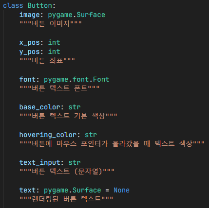
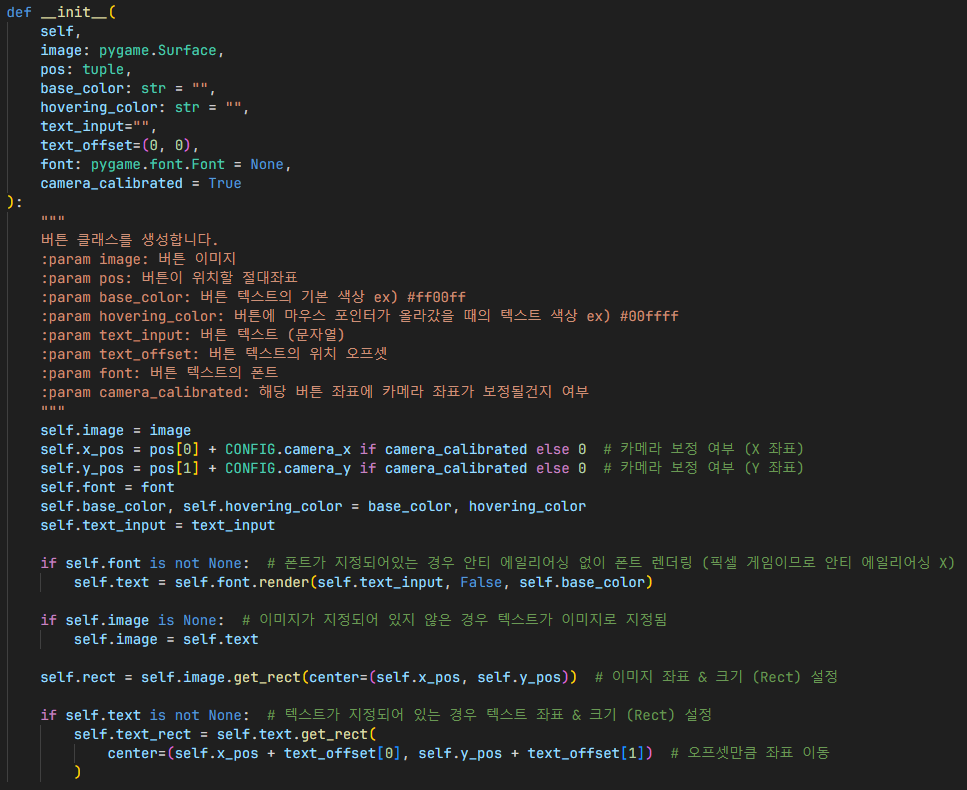
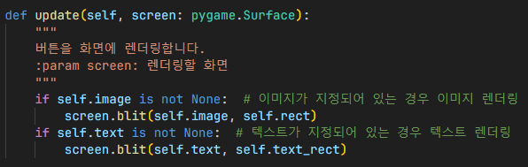
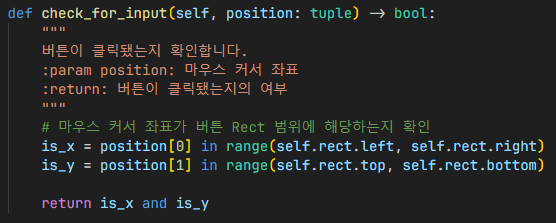
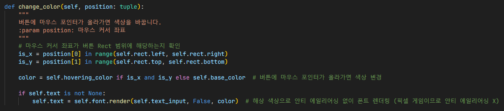
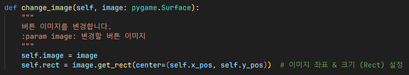

# 버튼

1. 버튼 이미지 설정
2. 좌표 설정 후 `camera_calibrated` 변수가 `True`인 경우 카메라 보정값 추가
3. 폰트, 색상 및 텍스트 (문자열) 변수 설정
4. 폰트가 지정되어있는 경우 폰트 렌더링 (픽셀 게임이므로 안티 에일리어싱은 필요없다고 판단)
5. 이미지가 지정되어 있지 않은 경우 텍스트가 이미지로 지정
6. 이미지 좌표 & 크기 (Rect) 설정
7. 텍스트가 지정되어 있는 경우 텍스트 좌표 & 크기 (Rect) 설정, 이 때 오프셋이 있는 경우 오프셋만큼 좌표 이동

## 렌더링

1. 이미지가 지정되어 있는 경우 이미지 렌더링
2. 텍스트가 지정되어 있는 경우 텍스트 렌더링

만약 텍스트 렌더링 후 이미지를 렌더링한다면,
텍스트는 덮어씌워지므로 렌더링 순서가 중요함.

## 클릭 확인

마우스 커서 좌표가 버튼 Rect 범위에 해당하는지 확인

- 이 때, `check_for_input()` 함수는 마우스 클릭 이벤트가 발생했을 때만 호출됨

## Hovering 시 색상 변경

1. 마우스 커서 좌표가 버튼 Rect 범위에 해당하는지 확인
2. 버튼에 마우스 포인터가 올라가면 Hovering 색상으로 변경, 그렇지 않으면 기본 색상으로 변경
3. 안티 에일리어싱 없이 해당 색상으로 폰트 렌더링

## 버튼 이미지 변경

- 설정 및 ESC 화면에서 유용하게 쓰임.

## 참조
- [`button.py`](../../components/button.py)