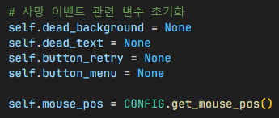
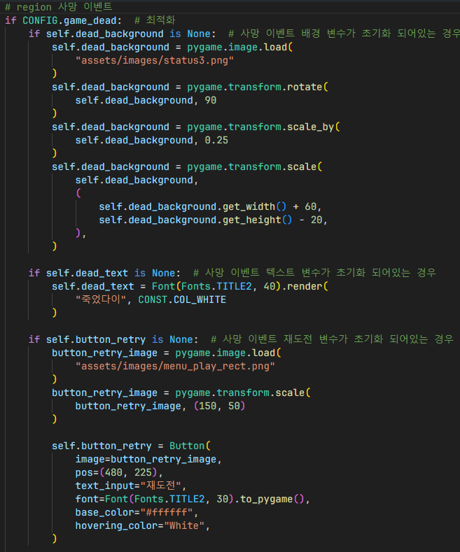
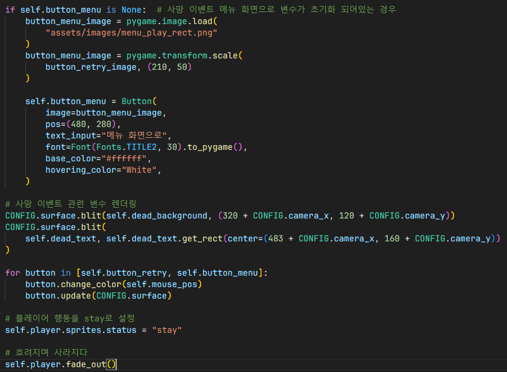
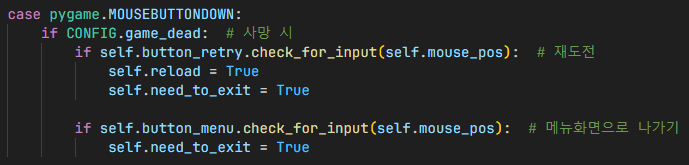
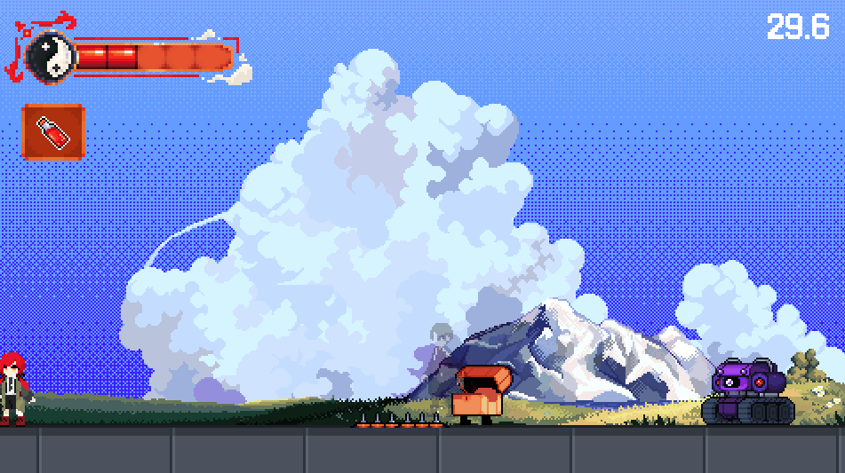

# 사망 이벤트

1. 사망 이벤트 관련 변수 초기화
2. 현재 마우스 좌표를 가져와 마우스 좌표값 할당

## 플레이어 사망 표시

1. 각 오브젝트를 스케일링 후 화면에 렌더링할 수 있도록 오브젝트 미리 초기화
2. 카메라 좌표 보정이 필요하다면 보정 후, 화면에 렌더링
3. 버튼 Hovering 시 Hovering 색상으로 변경
4. 플레이어 현재 기본 스프라이트 지정
5. 플레이어 페이드 아웃

## 사망 이벤트 관련 버튼 클릭 시

1. `Button.check_for_input()` 함수를 이용하여 각 버튼마다 클릭됐는지 확인 후, 각 버튼에 맞는 기능 실행
2. 재도전하는 경우, `Ingame` 클래스의 `reload` 변수와 `need_to_exit` 변수를 이용하여 다시 `Ingame` 클래스를 새롭게 불러옴
3. 메인 메뉴로 나가는 경우, `Ingame` 클래스의 `need_to_exit` 변수를 이용하여 자연스럽게 메인 메뉴로 이동

## 결과

- 재도전 버튼을 누르면, 게임이 다시 시작되어 처음부터 플레이할 수 있음
- 메뉴 화면으로 버튼을 누르면, 메뉴 화면으로 나가짐

## 참조
- [`ingame.py`](../../screens/ingame.py)