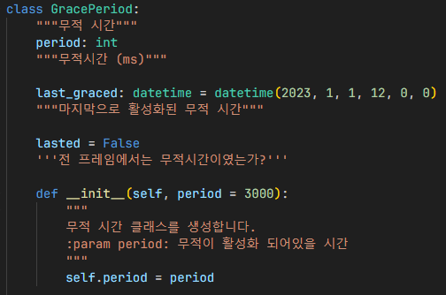
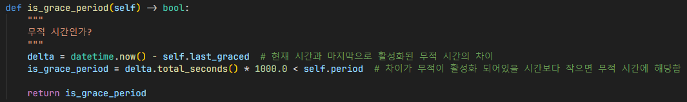
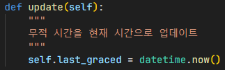
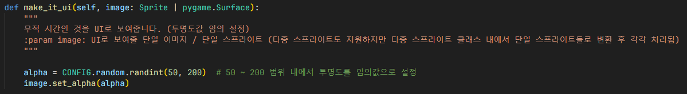
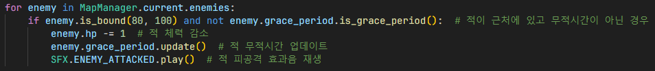
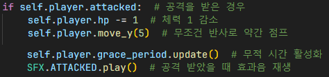
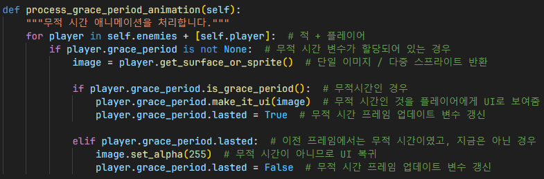
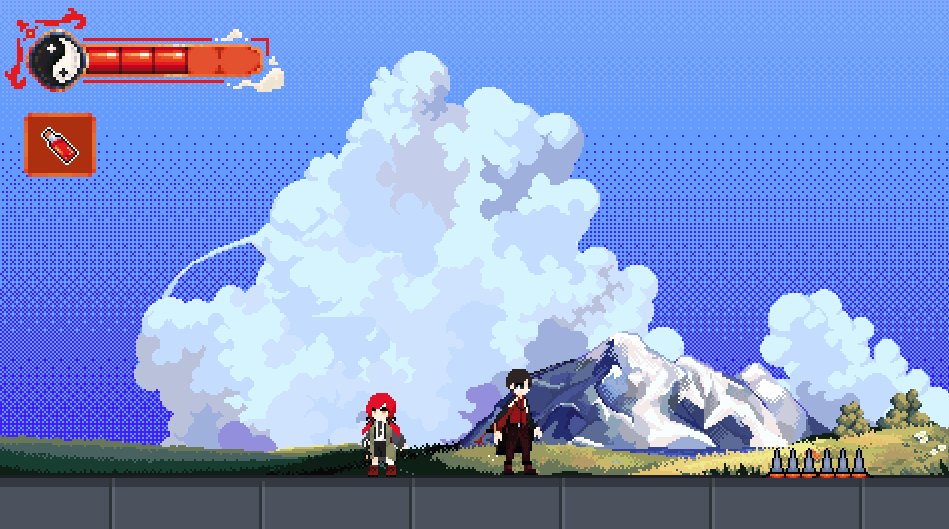

# 무적 시간

`GracePeriod`: 무적 시간을 관리하는 클래스.

무적 시간동안은 적이 플레이어를 공격할 수 없고,
플레이어도 데미지를 받지 않음.

## 무적 시간인지 확인

1. 현재 시간에서 마지막으로 활성화된 무적 시간만큼 차이를 구함
2. 그 차이가 무적시간 (무적이 활성화되어있을 시간)보다 작으면 무적 시간에 해당함

## 무적 시간 업데이트

`datetime` 클래스를 이용하여 현재 시간을 가져옴.

## 무적 시간인 것을 UI로 형상화

투명도를 임의값으로 설정하여 마치 플레이어가 무적 시간에 해당한다는 것을 알려줌.

또한, 플레이어가 데미지를 받았다는 의미도 포함됨.

## 인게임
### 무적 시간 업데이트

1. 적이 플레이어 근처에 있고 무적시간이 아니고 적이 공격을 받은 경우의 조건 검사
2. 적 체력 감소
3. `GracePeriod.update()`함수를 이용한 적 무적시간 업데이트
4. 적 피공격 효과음 재생

1. 플레이어가 공격을 받은 경우의 조건 검사
2. 체력 감소
3. 무조건 반사를 구현하기 위해 특정 상수배만큼 약간 점프
4. 무적 시간 활성화하고 업데이트
5. 플레이어 피공격 효과음 재생

### 무적 시간 애니메이션

## 결과

가시에 닿은 경우 (충돌 감지 함수를 이용), 무적 시간을 활성화하고 이를 UI로 형상화하여 유저에게 플레이어가 데미지를 받았다는걸 시각적으로 보여줌

## 참조
- [`grace_period.py`](../../components/events/grace_period.py)
- [`ingame.py`](../../screens/ingame.py)
- [`maps/__init__.py`](../../maps/__init__.py.py)