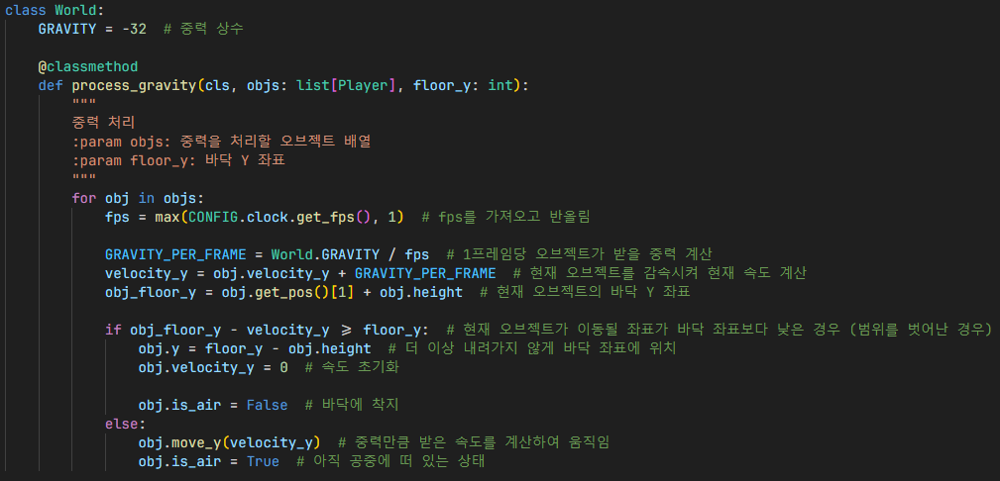
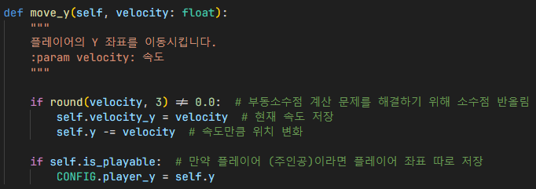
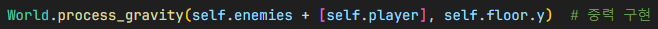
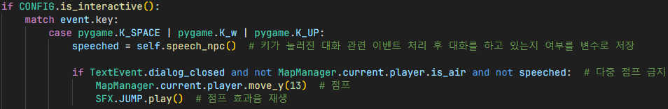

# 중력

- `GRAVITY`: 중력 상수이며, 값에 따라 중력 크기가 변함

1. 중력에 영향을 받을 오브젝트 열거
2. fps를 가져온 뒤 반올림
3. 가속도 법칙을 이용하여 현재 오브젝트가 받을 중력 계산
4. 중력을 적용한 속도로 바닥을 뚫는 경우, 즉 범위를 벗어난 경우 좌표를 바닥에 위치하고 속도를 0으로 초기화
5. 그렇지 않은 경우, 현재 오브젝트 속도에 중력 적용
6. 공중에 떠 있는지 확인하는 변수인 `is_air` 업데이트

게임에서 중력을 구현하기 위해,
물리학 I에서 배운 뉴턴의 운동 법칙을 사용함.

# 점프

중력을 구현하면, 이를 이용하기 위한 점프도 구현함.

1. 속도가 0인지 확인, 이 때 부동소수점 계산 문제를 해결하기 위해 소수점을 반올림하고 다시 계산
2. 속도가 0이 아닌 경우 현재 속도 저장 후 속도만큼 위치 변화, 이 때 가장 높은 Y 좌표가 0이므로 위치를 빼야 점프 효과가 날 수 있음.
3. 만약 플레이어 (주인공)이라면 플레이어 좌표 따로 저장하여 플레이어 관련 이벤트를 구현할 때 플레이어 좌표를 실시간으로 받아올 수 있음.

## 인게임

`World.process_gravity()` 함수를 이용하여 적과 플레이어에게 중력을 받도록 함.
- `floor.y`: 현재 맵 바닥의 Y좌표로 중력 때문에 바닥을 뚫고 지나가는걸 방지

1. 점프 키가 눌러진 경우 점프 키와 대화 상호작용 키가 동일하기 때문에 이를 구별하기 위해, 대화할 NPC가 일정 범위 안에 없는 경우 점프 이벤트로 인식
2. 대화를 하지 않았고 플레이어가 공중에 떠 있는 경우 다중 점프로 간주하고 다중 점프를 금지함
3. 다중 점프가 아닌 경우 특정 상수배만큼 점프
4. 점프한 경우 점프 효과음 재생

## 결과

## 참조
- [`world.py`](../../components/world.py)
- [`player.py`](../../characters/player.py)
- [`ingame.py`](../../screens/ingame.py)