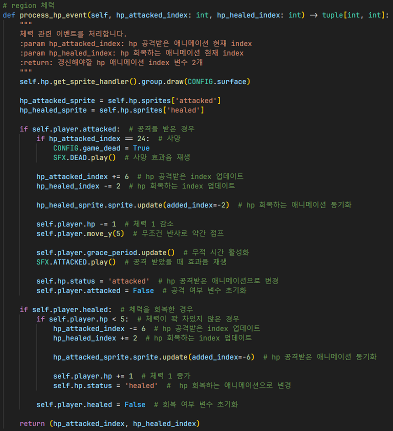
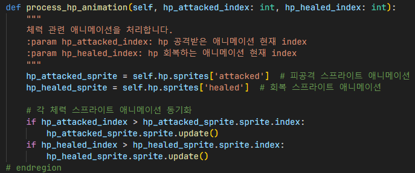
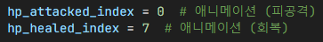
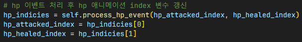
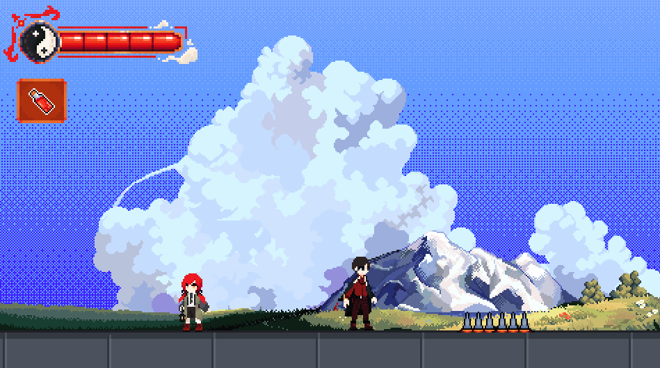

# 체력
## 체력 이벤트 처리

1. hp 스프라이트 렌더링
2. 각 hp 스프라이트 변수 할당
3. 공격을 받은 경우 사망 처리 후 효과음 재생
4. 피공격 및 회복 hp 스프라이트 index 갱신
5. 회복 hp 스프라이트 애니메이션 동기화
6. 체력 감소 후 무조건 반사를 구현하기 위해 약간 점프
7. 무적 시간 활성화 후 피공격 효과음 재생
8. 현재 hp 스프라이트 애니메이션을 피공격으로 변경 후 플레이어의 피공격 여부 변수 초기화
9. 체력을 회복했는지 확인 후 체력이 꽉 차있지 않았는지 확인
10. 조건을 충족한 경우, 피공격 및 회복 hp 스프라이트 index 갱신
11. 피공격 hp 스프라이트 애니메이션 동기화
12. 체력 증가 후 현재 hp 스프라이트 애니메이션을 회복으로 변경
13. 플레이어의 회복 여부 변수 초기화
14. 갱신해야 할 hp 스프라이트 애니메이션 index 변수 2개 반환

## 체력 애니메이션 처리

1. 피공격 및 회복 스프라이트 애니메이션 변수를 가져옴
2. 각 체력 스프라이트 애니메이션 동기화

## 인게임

1. 피공격 및 회복 hp 스프라이트 index 변수 할당
2. `process_hp_event()` 함수를 이용하여 hp 스프라이트 애니메이션 업데이트

## 결과

- 가시에 맞은 경우 플레이어가 공격을 받아 체력 감소
- 체력 회복 아이템을 사용한 경우 플레이어가 회복하여 체력 증가

## 참조
- [ingame.py](../../screens/ingame.py)