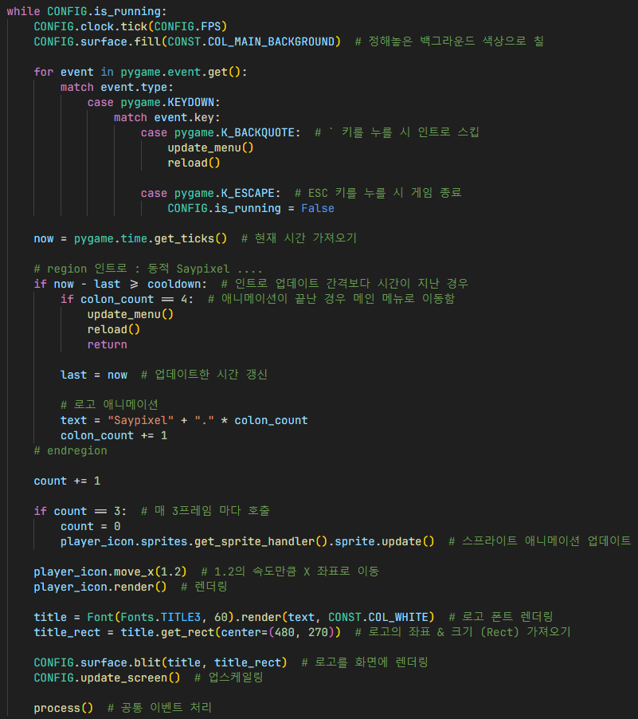

# 인트로
## 새로고침

- `Ctrl + R`을 누르면 게임을 새로고침함, 이 때 게임이 재시작될 떄 필요

1. 게임을 새로고침 해야하는 경우
2. 새로고침 변수 업데이트 후 음악 및 효과음 중지
3. 인트로 화면으로 이동
4. 만약 다시 새로고침하여 인트로 화면 함수가 종료된 경우 다시 `reload()` 함수에서 새로고침됨

## 인트로 화면

- `cooldown`: 인트로를 업데이트하는 시간 간격 (단위: ms)
- `last`: 현재 시간을 가져와서 업데이트한 시간 초기화
- `text`: 로고
- `colon_count`: 로고 애니메이션을 담당. 애니메이션 업데이트에 필요
- `player_icon`: 인트로 중 뛰는 아기자기한 플레이어, SpriteCollection, SpriteHandler, Sprite를 이용하여 다중 스프라이트를 사용하는 플레이어를 가져옴 (단일 스프라이트인 SpriteHandler만으로는 좌표 구성이 어렵기 때문에 다중 스프라이트를 이용)
- `count`: 매 프레임마다 업데이트 되는걸 지연, 몇 프레임마다 업데이트 될건지 설정

1. 매 프레임마다 반복
2. 정해놓은 백그라운드 색상으로 칠
3. 키보드 키 입력 관련 이벤트 처리
4. 업데이트한 시간 갱신 후 로고 애니메이션 업데이트
5. 매 3프레임 마다 플레이어 스프라이트 및 로고 애니메이션 업데이트
6. `Player.move_x()` 함수를 이용하여 특정 속도만큼 X 좌표에서 움직임
7. 플레이어 및 로고 렌더링
8. 업스케일링 후 모든 화면에서 공통으로 처리하는 이벤트 처리

## 참조
- [intro.py](../../screens/intro.py)