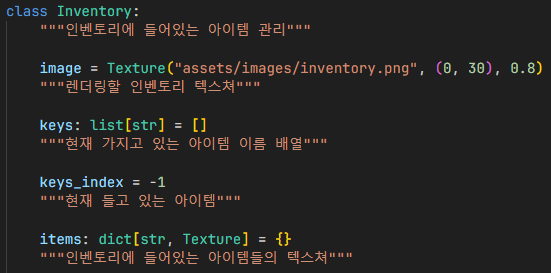
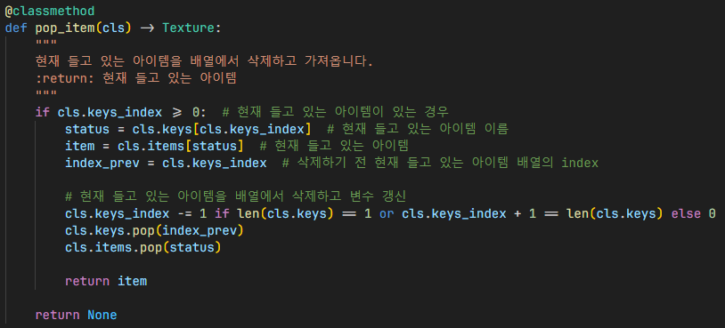
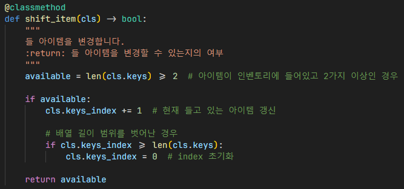
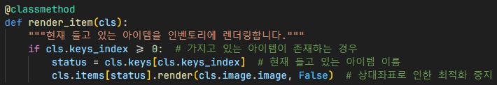
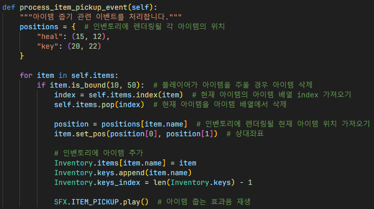
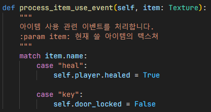
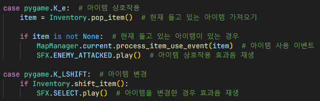
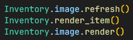

# 아이템
## 인벤토리

`Inventory`: 인벤토리에 들어있는 아이템을 관리하기 위한 클래스

### 아이템을 인벤토리에서 삭제

- `status`: 현재 들고 있는 아이템의 이름
- `item`: 현재 들고 있는 아이템 텍스쳐
- `index_prev`: 삭제하기 전에 들고 있었던 아이템의 index

아이템이 인벤토리에 있는 경우 현재 들고 있는 아이템을 배열에서 삭제하고 관련 변수 갱신

변수를 갱신할 때, 삭제된 아이템이 인벤토리 양 끝에 있었던 경우 index를 1만큼 빼고 그렇지 않은 경우 그대로 냅둠

### 아이템 변경

1. 아이템이 인벤토리에 들어있고 2가지 이상인 경우, 현재 들고 있는 아이템 변수 갱신
2. 아이템을 변경할 수 있는지 여부 확인 후 반환

### 아이템을 인벤토리에 렌더링

1. 인벤토리에 아이템이 존재하는 경우, 현재 들고 있는 아이템 이름 변수 할당
2. 현재 들고 있는 아이템 이름 변수를 통하여 아이템을 가져옴
3. 현재 들고 있는 아이템을 인벤토리에 렌더링

- 렌더링할 때, 아이템이 상대좌표로 지정되어 있어서 렌더링 최적화에 적용되지 않아 렌더링 최적화 옵션 비활성화

## 인게임
### 아이템 줍는 이벤트 처리

1. 인벤토리에 렌더링될 각 아이템의 위치 할당
2. 아이템 열거
3. 플레이어가 아이템 일정 범위에 있는 경우, 즉 플레이어가 아이템을 주울 경우
4. 현재 아이템의 아이템 배열 index를 가져오고 현재 들고 있는 아이템을 아이템 배열에서 삭제
5. 인벤토리에 렌더링될 현재 아이템 위치를 가져오고 상대좌표로 아이템 위치 지정
6. 인벤토리에 아이템 추가 후 관련 변수 갱신
7. 아이템 줍는 효과음 재생

### 아이템 사용 이벤트 처리

1. 회복 아이템인 경우, 플레이어의 회복 변수 갱신
2. 열쇠 아이템인 경우, 문 잠김 변수 갱신

### 아이템 관련 키가 눌러진 경우

1. 아이템 상호작용 키가 눌러진 경우, `Inventory.pop_item()` 함수를 이용하여 현재 들고 있는 아이템 가져옴
2. 현재 들고 있는 아이템이 있는 경우, `process_item_use_event()` 함수를 이용하여 아이템 사용
3. 아이템 상호작용 효과음 재생
4. 아이템 변경 키가 눌러진 경우, `Inventory.shift_item()` 함수를 이용하여 아이템 변경
5. 아이템이 변경된 경우, 아이템 변경 효과음 재생

### 인벤토리 렌더링

1. 인벤토리 이미지 원본을 재렌더링하여 기존에 있던 아이템을 덮어씌움
2. 현재 들고 있는 아이템을 인벤토리 이미지에 렌더링
3. 인벤토리 이미지 렌더링

## 결과

- 플레이어가 아이템의 일정 범위 안에 있으면 아이템을 주움
- 문을 열 때 열쇠 아이템을 사용
- 플레이어가 공격을 받았을 때 회복 아이템을 사용할 수 있음

## 참조
- [`inventory.py`](../../components/inventory.py)
- [`ingame.py`](../../screens/ingame.py)
- [`maps/__init__.py`](../../maps/__init__.py)