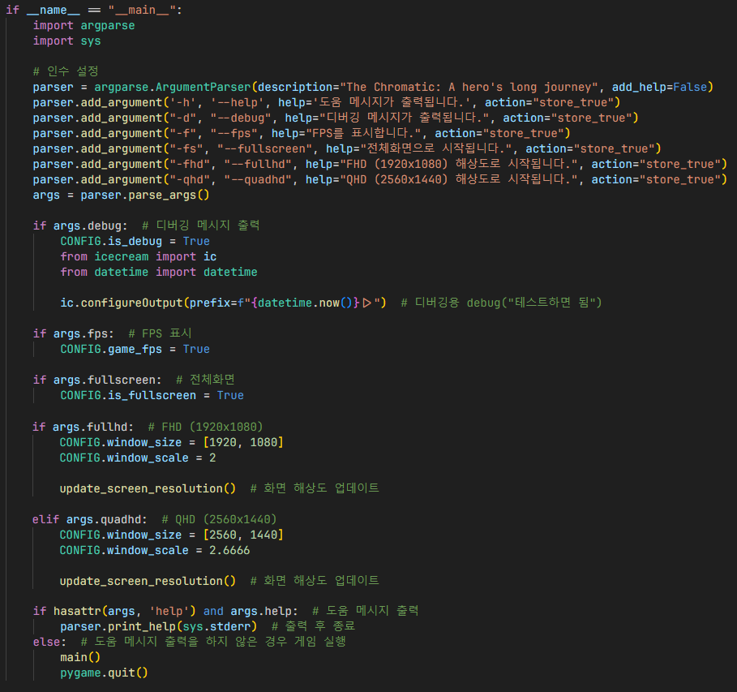

# 게임 실행

1. pygame 지원 메시지 숨김
2. 게임 실행 시 모니터 중심에서 실행되게 설정

1. 클래스 초기화
2. 게임 아이콘을 불러온 후 32x32 크기로 스케일링
3. 게임 아이콘 및 제목 적용

## CLI

1. 인수 설정
2. 인수에 맞게 게임 옵션 설정
3. 도움 메시지 출력시 출력 후 게임 종료
4. 그렇지 않은 경우, 게임 실행

### 인수 모음
- `-h`: 도움 메시지 출력
- `-d`: 디버깅 메시지 출력
- `-f`: FPS 표시
- `-fs`: 전체화면
- `-fhd`: FHD 해상도 (1920x1080)
- `-qhd`: QHD 해상도 (2560x1440)

## 참조
- [`main.py`](../../main.py)