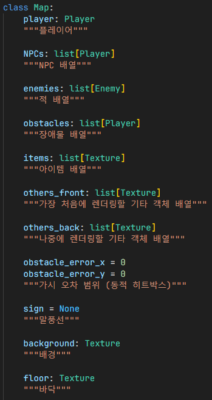
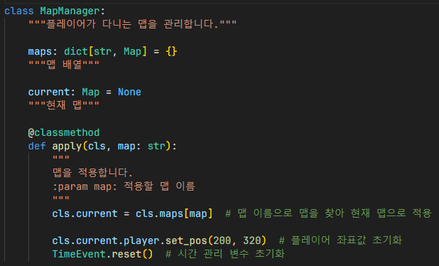
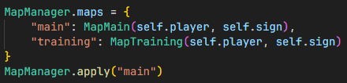
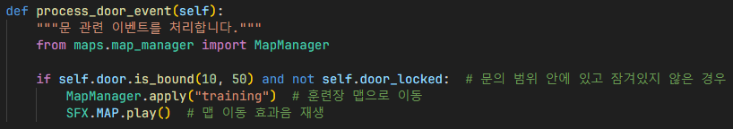
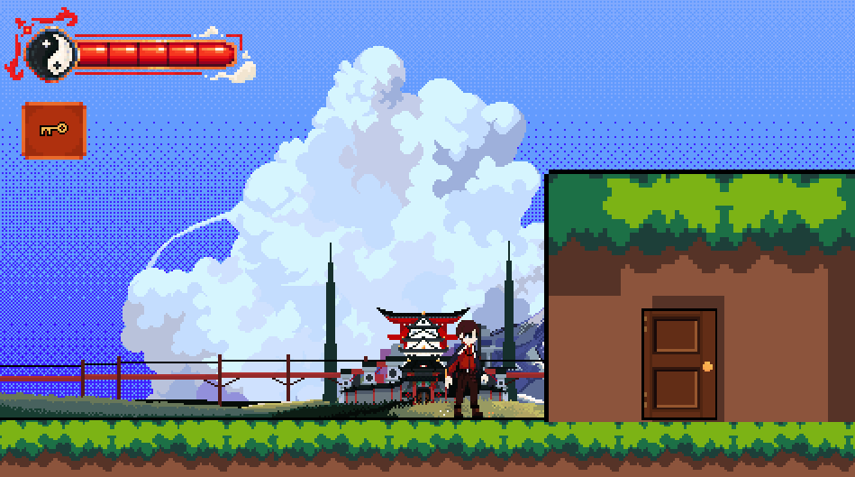

# 맵 관리
## Map

`Map`: 맵의 기본 뼈대, 상속됨

## MapManager

`MapManager`: 플레이어가 다니는 맵과 다른 맵들을 관리하기 위한 클래스

1. 맵 이름으로 맵을 찾아 현재 플레이어가 다니는 맵으로 적용
2. 플레이어 좌표값과 시간 관리 변수 초기화, 버그 방지를 위함

## 인게임

1. 플레이어가 다닐 수 있는 맵들을 지정 후 `MapManager.maps` 변수에 할당
2. 플레이어가 다니는 기본 맵을 `main`으로 지정

1. 메인 맵에서 문을 열 수 있는 조건이 충족되어 문을 연 경우, 훈련장 맵으로 이동
2. 맵 이동 효과음 재생

## 결과

## 참조
- [`maps/__init__.py`](../../maps/__init__.py)
- [`maps/map_main.py`](../../maps/map_main.py)
- [`maps/map_manager.py`](../../maps/map_manager.py)
- [`ingame.py`](../../screens/ingame.py)