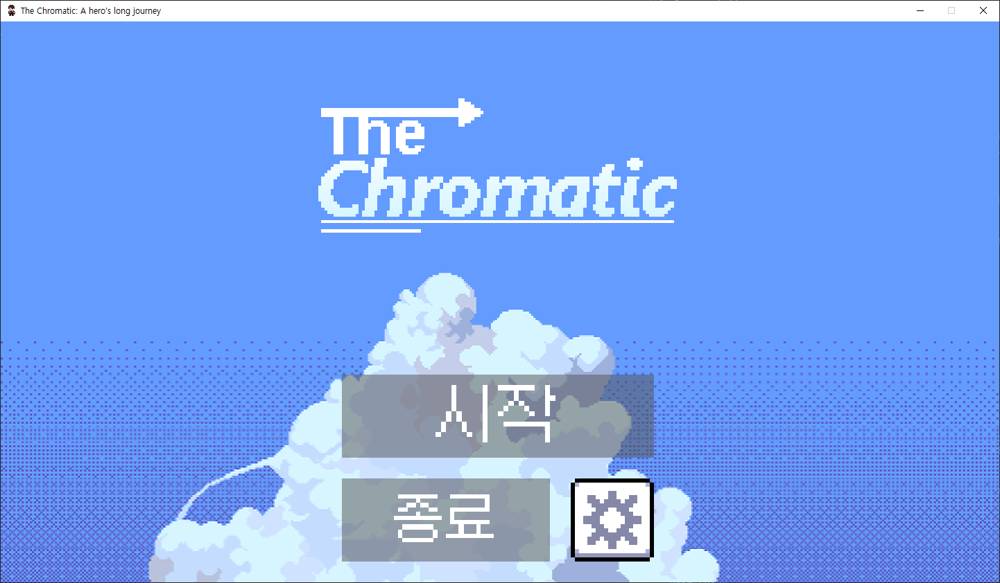

# 메인 메뉴
## 키보드 및 마우스 입력 처리 이벤트

1. Ctrl 키가 눌렸는지 확인 후, 여부를 `ctrl` 변수에 저장
2. `Button.check_for_input()` 함수를 이용하여 각 버튼마다 클릭됐는지 확인 후, 각 버튼에 맞는 기능 적용
3. 시작 버튼을 누른 경우, 메인 음악을 정지하고 인게임 변수 초기화 후 인게임으로 화면 업데이트
4. 설정 버튼을 누른 경우, 설정 창 표시
5. `ESC` 키를 누르거나 종료 버튼을 누른 경우 게임 종료
6. `Ctrl + R` 키를 누른 경우 게임 재시작

- `reload`: `Ctrl + R`키를 통하여 재시작을 해야하는 경우 이 변수를 이용하여 인트로 화면부터 시작됨
- `music_playing`: 음악이 재생되고 있는지 여부로, 음악이 중지되면 이 값은 `False`로 지정됨

- `need_to_exit`: ESC 화면을 닫아야 하는 경우 이 변수를 이용하여 ESC 화면이 닫히고 인게임에서 게임을 진행하게 설정

1. 각 오브젝트를 스케일링 후 화면에 렌더링할 수 있도록 오브젝트 미리 초기화 후 이미지 스케일링
2. 메인 메뉴 음악 재생, 설정에서 정해진 음량으로 음량을 정하고 음악 무한 반복

1. `CONFIG.get_mouse_pos()` 함수를 이용하여 업스케일링 및 카메라 좌표가 보정된 마우스 커서 좌표를 가져옴
2. 화면에 각 오브젝트 렌더링
3. 버튼 Hovering 시 Hovering 색상으로 변경
4. 화면 업스케일링 후 키보드 및 마우스 입력 이벤트 처리

## 결과

## 참조
- [`menu.py`](../../screens/menu.py)