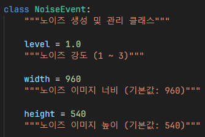
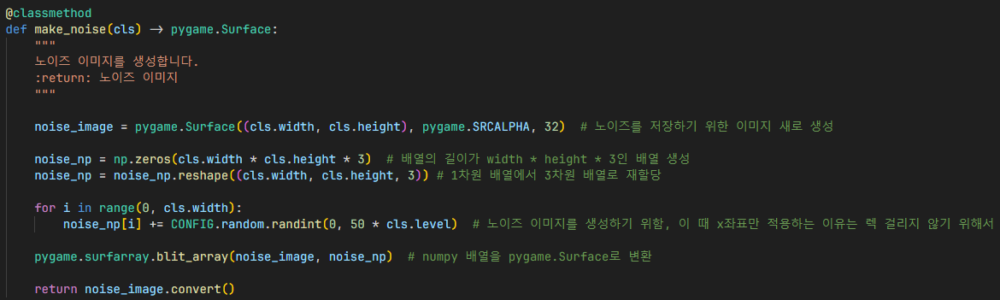

# 노이즈

`NoiseEvent`: 노이즈 이미지를 생성하고 기존 이미지에 합성해주는 클래스

- `level`: 노이즈 강도로, 1.0 부터 3.0 까지 설정할 수 있음. 기본값은 1.0
- `width`: 노이즈 이미지의 너비로, 기본값은 화면 너비인 960
- `height`: 노이즈 이미지의 높이로, 기본값은 화면 높이인 540

1. 노이즈를 저장하기 위한 pygame 이미지 새로 생성
2. 배열의 길이가 `width` * `height` * 3인 배열 생성, 3을 곱하는 이유는 RGB 정보를 저장하기 위함. 즉 이미지 넓이를 저장하는 셈
3. 1차원 배열에서 3차원 배열로 배열 차원 재할당
4. 노이즈 이미지를 생성하기 위해 무작위 색상을 이미지에 적용
5. numpy 배열을 pygame.Surface로 변환
6. 노이즈가 저장된 이미지 반환

성능을 최적화하기 위해 `numpy` 패키지와 `pygame.Surface.convert()` 함수를 사용함.

1. 기존 배경 이미지 복사
2. 복사한 이미지에 SUBTRACT 모드로 노이즈 이미지 합성
3. 노이즈 이미지가 합성된 복사한 이미지 반환

## 인게임

1. 기존 배경 이미지로, 시간을 되감고 있지 않은 경우 기존 배경 이미지 그대로 렌더링
2. 시간을 되감고 있는 경우, `NoiseEvent.make_noise()` 함수를 이용하여 노이즈 이미지 생성
3. `NoiseEvent.blend()` 함수를 이용하여 노이즈 이미지와 기존 배경 이미지를 합성 후 배경 이미지에 새로 할당
4. 시간을 되감고 있는 경우 노이즈 이미지가 합성된 이미지로 배경 렌더링

## 참조
- [`noise.py`](../../components/events/noise.py)
- [`maps/__init__.py`](../../maps/__init__.py)