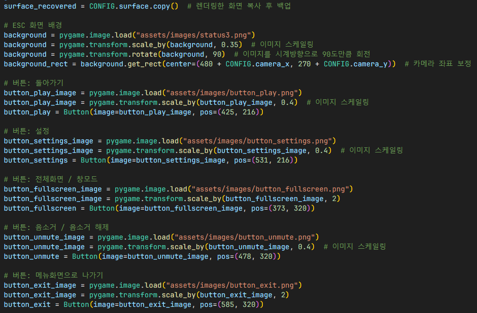

# ESC 화면
## 키보드 및 마우스 입력 처리 이벤트

1. `Button.check_for_input()` 함수를 이용하여 각 버튼마다 클릭됐는지 확인 후, 각 버튼에 맞는 설정 적용
2. 필요한 경우, 이미지 스케일링 및 값에 맞춰 이미지 변경
3. 메인 메뉴로 나가는 경우, `Ingame` 클래스의 `need_to_exit` 변수를 이용하여 자연스럽게 메인 메뉴로 이동
4. `ESC` 키를 누른 경우 ESC 화면을 나가 인게임에서 게임 진행

## ESC 화면 표시

- `surface_recovered`: 설정창 표시 전 렌더링되고 있었던 화면 백업용 (ESC 화면을 닫았을 때 렌더링 작업 유지하기 위함)
- `need_to_exit`: ESC 화면을 닫아야 하는 경우 이 변수를 이용하여 ESC 화면이 닫히고 인게임에서 게임을 진행하게 설정

1. 각 오브젝트를 스케일링 후 화면에 렌더링할 수 있도록 오브젝트 미리 초기화
2. 보정이 필요하다면 카메라 좌표 보정 및 이미지 스케일링

1. `CONFIG.get_mouse_pos()` 함수를 이용하여 업스케일링 및 카메라 좌표가 보정된 마우스 커서 좌표를 가져옴
2. 카메라 좌표 보정이 필요하다면 보정 후, 화면에 렌더링
3. 버튼 Hovering 시 Hovering 색상으로 변경
4. 화면 업스케일링 후 키보드 및 마우스 입력 이벤트 처리
5. ESC 화면이 닫힌 경우 인게임에서 렌더링 중이였던 화면 복구 및 설정 관련 변수 초기화

## 결과

## 참조
- [`pause_menu.py`](../../screens/pause_menu.py)