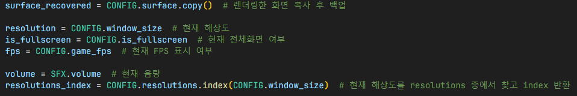

# 설정
## 화면 해상도 업데이트

1. 전체화면으로 설정해야하는 경우, 전체화면 flag 메시지 설정 후 사용자 지정 해상도 적용
2. 그렇지 않은 경우, flag 메시지없이 창모드로 사용자 지정 해상도 적용

## 적용

1. 화면 관련 변수를 게임 설정에 적용
2. 화면 해상도 업데이트
3. 소리 관련 변수 및 함수를 게임 설정에 적용

- 확인 버튼 누를 시 실행되는 함수

## 키보드 키 및 마우스 입력 이벤트 처리

- `Button.check_for_input()` 함수를 이용하여 각 버튼마다 클릭됐는지 확인 후, 각 버튼에 맞는 옵션 설정

1. ESC 키가 눌렸으면 취소 버튼과 같은 역할을 수행
2. Enter 키가 눌렸으면 확인 버튼과 같은 역할을 수행

## 설정창을 화면에 표시

- `surface_recovered`: 설정창 표시 전 렌더링되고 있었던 화면 백업용 (설정창을 닫았을 때 렌더링 작업 유지하기 위함)
- `need_to_exit`: 설정창을 닫아야 하는 경우 이 변수를 이용하여 설정창이 닫히게 설정
- `resolution`: 현재 해상도
- `is_fullscreen`: 현재 전체화면 여부
- `fps`: 현재 FPS 표시 여부
- `volume`: 현재 음량 (기본: 1.0, 범위: 0.0~1.0)
- `resolutions`: 적용할 수 있는 해상도 배열
- `resolutions_index`: 현재 해상도 (`resolution`)에 맞는 해상도 배열의 index

1. 각 오브젝트를 스케일링 후 화면에 렌더링할 수 있도록 오브젝트 미리 초기화
2. 보정이 필요하다면 카메라 좌표 보정

1. `CONFIG.get_mouse_pos()` 함수를 이용하여 업스케일링 및 카메라 좌표가 보정된 마우스 커서 좌표를 가져옴
2. 카메라 좌표 보정이 필요하다면 보정 후, 화면에 렌더링
3. 버튼 Hovering 시 Hovering 색상으로 변경
4. 화면 업스케일링 후 키보드 및 마우스 입력 이벤트 처리
5. 설정창이 닫힌 경우 인게임에서 렌더링 중이였던 화면 복구 및 설정 관련 변수 초기화

## 결과

## 참조
- [`settings.py`](../../screens/settings.py)
- [`events/__init__.py`](../../components/events/__init__.py)