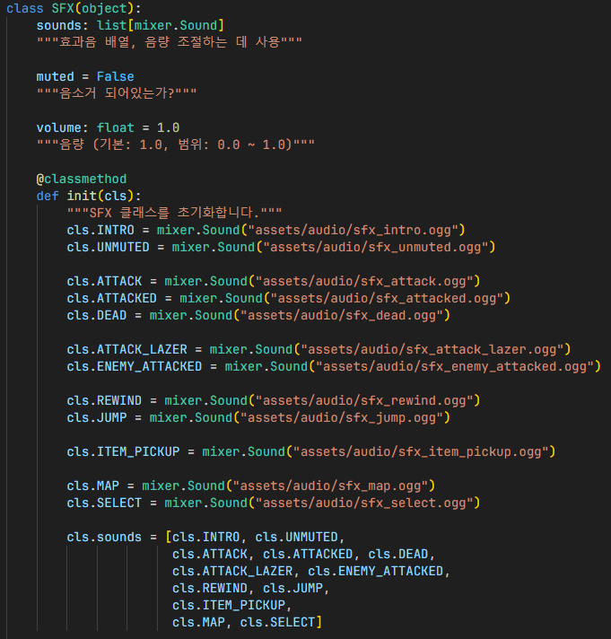
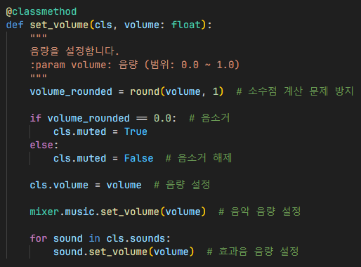
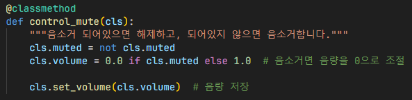

# SFX

`SFX`: 효과음을 관리하고 재생하기 위한 클래스

1. 각 효과음 변수 초기화
2. 각 효과음이 들어있는 효과음 배열 초기화

## 음량 설정

1. 소수점 계산 문제 방지를 위하여, 음량을 반올림 처리
2. 음량이 0으로 지정되어 있는 경우, 음소거 변수 설정
3. 음량 변수를 새로 갱신
4. 음악 및 효과음 음량 설정

## 음소거 설정 / 해제

1. 음소거 변수가 설정되어있으면 해제하고, 해제되어있으면 설정으로 변경
2. 만약 음소거라면, 음량을 0으로 조절
3. 음소거 아니라면, 음량을 1.0으로 조절
4. 음량 저장

## 참조
- [`sfx_collection.py`](../../components/sfx_collection.py)