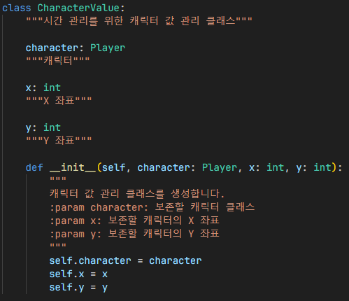
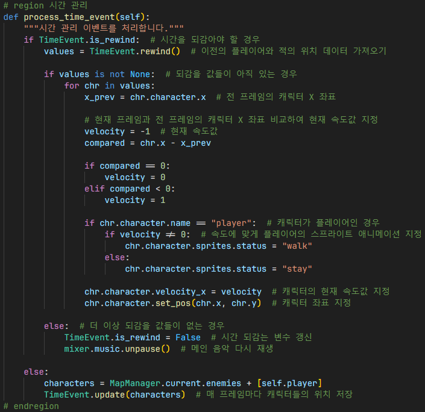
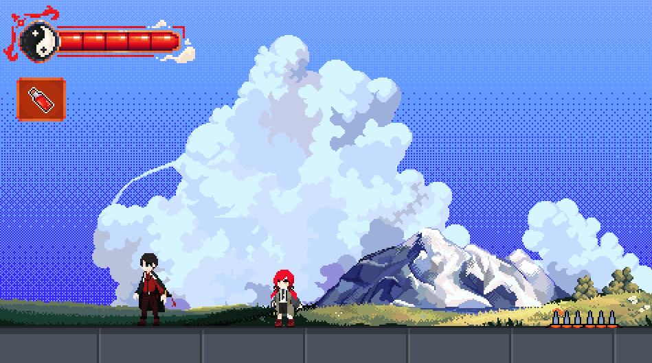

# 시간 관리
## CharacterValue

`CharacterValue`: 시간 관리를 하기 위하여 캐릭터 값을 관리하고 저장하는 클래스

- `rewind()`: 저장된 캐릭터 값을 pop하고 불러옴
- `update()`: 각 캐릭터 값 저장
- `reset()`: 저장된 모든 캐릭터 값 삭제

## 인게임

1. 시간 관리 키를 누른 경우 대화창이 닫혀 있는지 확인, 버그 방지를 하기 위함
2. 시간 관리 변수 갱신 후 메인 음악을 일시정지하고 시간 관리 효과음 재생

1. `TimeEvent.is_rewind` 변수를 통하여 시간을 되감아야 하는지 확인
2. 되감을 값들이 아직 있는지 확인 후, 현재 프레임과 전 프레임의 캐릭터 X 좌표를 비교하여 캐릭터의 현재 속도값과 좌표 지정
3. 캐릭터가 플레이어인 경우, 속도에 맞는 플레이어의 스프라이트 애니메이션 지정
4. 더 이상 되감을 값들이 없는 경우, 시간 되감는 변수를 갱신하고 메인 음악을 다시 재생시킴
5. 시간을 되감지 않는 경우, 매 프레임마다 캐릭터들의 위치 저장

## 결과

R키를 눌러 시간을 되돌릴 수 있음

## 참조
- [`time.py`](../../components/events/time.py)
- [`ingame.py`](../../screens/ingame.py)