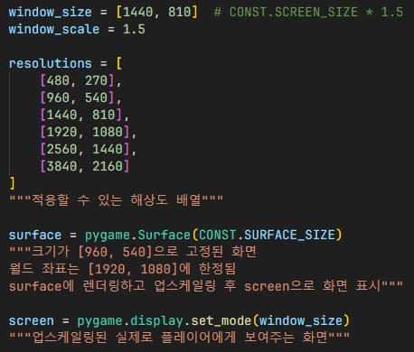

# 업스케일링
## 1

본래 렌더링되는 화면의 크기를 정함

## 2

업스케일링 할 크기를 정하고 몇배만큼 늘릴건지 정함

- `surface`: 세계를 렌더링할 화면
- `screen`: 카메라 크기만큼 화면을 자르고 업스케일링 후 최종적으로 출력할 화면

## 3

1. `pygame.transform.scale()` 함수로 `surface` 변수에 렌더링 후 업스케일링
2. 업스케일링한 화면을 `screen` 변수에 저장하여 최종적으로 `screen` 변수로 화면 출력

## 참조
- [`config.py`](../../components/config.py)